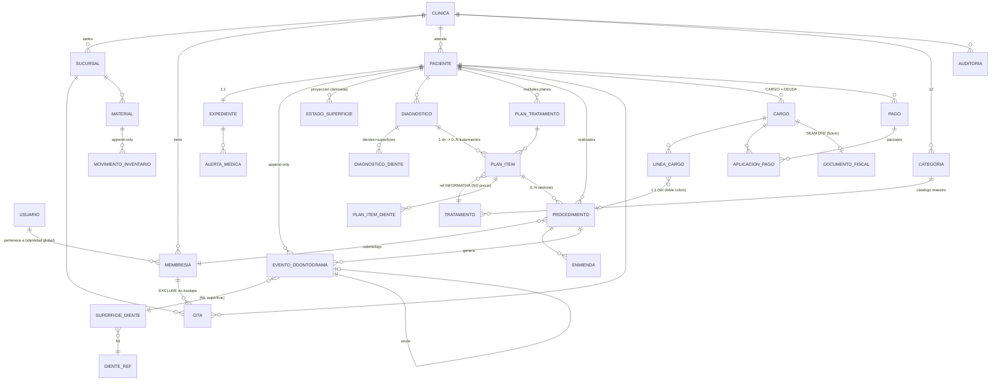

# Arquitectura de CLIDENT

> Documento canónico. Refleja las decisiones aprobadas en el Ciclo 0. Toda decisión estructural difícil de revertir tiene su ADR en `docs/ADR/`.
>
> Las reglas operativas obligatorias están en `CLAUDE.md`. Las reglas de negocio, en español para el propietario, están en `docs/REGLAS-DE-NEGOCIO.md`.

## Restricción rectora

El propietario **no es programador**. El sistema será mantenido principalmente por agentes de IA. Toda decisión se optimiza para arquitectura convencional, sin herramientas exóticas, sin sobreingeniería, sin dependencias innecesarias.

> **Principio rector:** se hace cumplir en la base de datos cuando el mecanismo es legible. Cuando el mecanismo de base de datos sería más confuso que el bug que previene, se hace en la aplicación y se prueba. **Excepción:** los invariantes de seguridad y de dinero se hacen cumplir en la base aunque cueste legibilidad, porque su lado malo no tiene techo.

---

# 1. Stack

| Pieza | Elección | Por qué |
|---|---|---|
| Framework | **Next.js (App Router)** | Un solo proyecto con frontend y backend. La combinación mejor documentada que existe: la que los agentes de IA mantienen con menos errores. |
| Lenguaje | **TypeScript** | Los errores de tipo son la red de seguridad más barata para un mantenedor no programador. |
| Base de datos | **PostgreSQL** | Integridad real: transacciones, `EXCLUDE`, RLS, `CHECK`, columnas generadas. Todo el diseño descansa en esto. |
| ORM | **Prisma 7** | Convencional, tipado, migraciones versionadas. Sus límites se cubren con SQL a mano (§9). |
| Hosting BD | **Neon** | PostgreSQL administrado con ramas, respaldos automáticos, sin servidor que mantener. |
| Hosting app | **Vercel** | Despliegue directo desde Git. |
| UI | **Tailwind + shadcn/ui** | Componentes copiados al repo, no una dependencia opaca. |
| Auth | **Auth.js** (credenciales + JWT) | Convencional. Versión fijada explícitamente. |
| Validación | **Zod** | Un esquema compartido cliente/servidor. |
| Pruebas | **Vitest** + PostgreSQL real | RLS y constraints no se pueden simular. |
| Package manager | **npm** | Ya presente. Sin Docker. |

**El stack son 8 piezas. Cada dependencia nueva requiere un ADR y autorización.**

---

# 2. Estructura de carpetas

```
clident/
├─ prisma/
│  ├─ schema.prisma
│  ├─ migrations/                  # incluye SQL escrito a mano (§9)
│  └─ seed/
│     ├─ dientes.ts                # deriva dientes_ref y superficies_diente
│     ├─ categorias.ts             # 12 categorías (plantillas globales)
│     └─ tratamientos.ts           # ~100 plantillas globales
├─ prisma.config.ts                # Prisma 7: la URL vive aquí, no en schema.prisma
├─ infra/
│  └─ bootstrap-roles.sql          # los 4 roles de PostgreSQL
├─ src/
│  ├─ app/
│  │  ├─ (auth)/login/ elegir-clinica/
│  │  ├─ (app)/                    # autenticado con clínica activa
│  │  │  ├─ dashboard/ agenda/ catalogo/ caja/ inventario/ configuracion/
│  │  │  └─ pacientes/[pacienteId]/
│  │  │     ├─ expediente/ odontograma/ diagnosticos/ planes/[planId]/
│  │  │     └─ procedimientos/ estado-cuenta/ historial/
│  │  └─ operador/                 # consola del operador de plataforma
│  ├─ server/                      # SOLO servidor
│  │  ├─ db/                       # ÚNICO consumidor de Prisma
│  │  │  ├─ client.ts              # único lugar que construye PrismaClient
│  │  │  ├─ tenant.ts              # único lugar que toca set_config
│  │  │  ├─ operador.ts            # cliente Prisma del rol operador
│  │  │  ├─ raw/                   # ÚNICO lugar con $queryRaw
│  │  │  └─ pacientes.ts citas.ts odontograma.ts diagnosticos.ts
│  │  │     tratamientos.ts planes.ts procedimientos.ts caja.ts
│  │  │     inventario.ts membresias.ts auditoria.ts
│  │  ├─ auth/  context.ts permissions.ts config.ts
│  │  ├─ actions/                  # Server Actions, una por módulo
│  │  ├─ dto/                      # mappers DB → cliente (enmascarado)
│  │  ├─ odontograma/  reducer.ts rebuild.ts
│  │  ├─ operador/                 # flujos del operador de plataforma
│  │  └─ billing/dte/  types.ts noop-provider.ts   # seam DTE, sin implementación
│  ├─ lib/
│  │  ├─ validation/               # Zod, compartido
│  │  └─ money.ts dui.ts dientes.ts errors.ts
│  ├─ components/  ui/ odontograma/ shared/
│  └─ types/
├─ tests/
│  ├─ unit/
│  └─ integration/                 # suites críticas (§13)
├─ docs/
│  ├─ ARQUITECTURA.md  REGLAS-DE-NEGOCIO.md  FLUJO-DE-DESARROLLO.md
│  └─ ADR/
└─ CLAUDE.md
```

**Reglas codificadas en la estructura, aplicadas por ESLint:**
- Importar `@prisma/client` fuera de `src/server/db/**` → error de build.
- Importar `src/server/db/operador.ts` fuera de `src/server/operador/**` → error de build.
- `$queryRaw` fuera de `src/server/db/raw/` → error de build.
- `$queryRawUnsafe` / `$executeRawUnsafe` en cualquier lado → error de build.

---

# 3. Multi-tenancy

## 3.1 Identidad y pertenencia

```
Usuario (identidad global: correo, contraseña)      ← SIN clinicaId
   └── Membresia (usuarioId + clinicaId + roles[])  ← única por par usuario-clínica
          └── Clinica                                ← el inquilino
                └── Sucursal                         ← "Sede principal" autocreada
```

Un profesional que trabaja en dos clínicas tiene **un usuario y dos membresías**, con roles potencialmente distintos en cada una. (ADR-003)

**El odontólogo no es una tabla aparte:** es una membresía que tiene `ODONTOLOGO` entre sus roles. Sus datos profesionales (número de JVPO, especialidad, color de agenda) viven en la membresía, porque son datos de esa persona *en esa clínica*.

**Consecuencia:** `odontologoId` referencia una **membresía**, no un usuario. Esto hace que el constraint de no-doble-booking quede aislado por clínica automáticamente.

## 3.2 Sucursal

`Sucursal` existe desde el día 1, con una fila "Sede principal" autocreada por clínica y **sin interfaz en el MVP**. (ADR-002)

**Lleva `sucursalId`:** citas, cargos, pagos, cortes de caja, inventario, procedimientos.
**No lleva:** paciente, expediente, odontograma, diagnósticos, planes. El paciente es de la clínica y se atiende en cualquier sede; su expediente lo sigue.

**Consecuencia:** la regla de no-doble-booking es **por odontólogo, no por sucursal**. Un dentista no puede estar en dos sedes a las 10:00.

## 3.3 Preparación SaaS (mínima)

`Clinica.estado` (`ACTIVA` | `SUSPENDIDA` | `PRUEBA`) + fecha de vigencia opcional. Permite cortar acceso por falta de pago sin integrar cobros.

**Fuera de alcance:** registro público, suscripciones, Stripe, planes, trials, onboarding automatizado. Se cuelgan de `Clinica` cuando existan clínicas pagando.

---

# 4. Aislamiento de inquilinos

## 4.1 Dos capas (ADR-001)

**Capa 1 — Repositorios con alcance explícito (primaria).**

```ts
export async function getPaciente(ctx: TenantContext, id: string) {
  // SIEMPRE clinicaId + id. NUNCA findUnique({ where: { id } }).
  const p = await db.paciente.findFirst({ where: { id, clinicaId: ctx.clinicaId } });
  if (!p) throw new AppError('NOT_FOUND');   // cross-tenant se ve igual que inexistente
  return p;
}
```

Se **descartó** una extensión de Prisma que inyectara `clinicaId` automáticamente: `db.paciente.findMany({})` *parece* un escaneo completo y un agente no puede saber leyendo esa línea si es seguro. Además falla en silencio con escrituras anidadas, `upsert` y SQL crudo. Una magia correcta el 95% del tiempo entrena a los agentes a dejar de pensar en el aislamiento.

**Capa 2 — Row Level Security de PostgreSQL (red de seguridad).** Con filtros explícitos, olvidar uno es posible. RLS convierte ese olvido en cero filas en vez de una filtración.

## 4.2 Roles de PostgreSQL

| Rol | Quién lo usa | Privilegios | Superusuario |
|---|---|---|---|
| `clident_migrator` | Solo migraciones en CI/CD | Dueño de tablas, DDL, `BYPASSRLS` | **No** |
| `clident_app` | Toda la aplicación en runtime | Solo DML. Sin DDL, sin `BYPASSRLS`, **no es dueño de nada** | **No** |
| `clident_operador` | Consola del operador | Angosto (§7) | **No** |
| `clident_readonly` | Diagnóstico | Solo `SELECT`, sujeto a RLS | **No** |

**Ninguno es superusuario.** En Supabase esto significaría no usar el rol `postgres`; en Neon, no usar el rol propietario por defecto para la aplicación.

```sql
REVOKE ALL ON SCHEMA public FROM PUBLIC;
GRANT USAGE ON SCHEMA public TO clident_app;     -- USAGE, nunca CREATE
GRANT SELECT, INSERT, UPDATE, DELETE ON ALL TABLES IN SCHEMA public TO clident_app;
GRANT USAGE ON ALL SEQUENCES IN SCHEMA public TO clident_app;

-- Crítico: sin esto, cada tabla nueva rompe producción con "permission denied"
ALTER DEFAULT PRIVILEGES FOR ROLE clident_migrator IN SCHEMA public
  GRANT SELECT, INSERT, UPDATE, DELETE ON TABLES TO clident_app;
ALTER DEFAULT PRIVILEGES FOR ROLE clident_migrator IN SCHEMA public
  GRANT USAGE ON SEQUENCES TO clident_app;
```

**Protección por privilegios:**
- Tablas append-only (`eventos_odontograma`, `auditoria`, `movimientos_inventario`, `aplicaciones_pago`): `clident_app` recibe **solo `SELECT` e `INSERT`**.
- Tablas de referencia global (`dientes_ref`, `superficies_diente`): `clident_app` recibe **solo `SELECT`**. Una clínica no puede alterar la dentición humana.

## 4.3 FORCE ROW LEVEL SECURITY

```sql
ALTER TABLE pacientes ENABLE ROW LEVEL SECURITY;
ALTER TABLE pacientes FORCE  ROW LEVEL SECURITY;

CREATE POLICY tenant_isolation ON pacientes
  USING      (clinica_id = NULLIF(current_setting('app.clinica_id', true), ''))
  WITH CHECK (clinica_id = NULLIF(current_setting('app.clinica_id', true), ''));
```

`ENABLE` por sí solo **no aplica las políticas al dueño de la tabla ni a superusuarios**. Sin `FORCE`, si la aplicación llegara a conectarse con el rol dueño, todas las clínicas quedan expuestas en silencio. Con `FORCE`, el mismo error se manifiesta como cero filas. Costo: cero en runtime.

El `WITH CHECK` es tan importante como el `USING`: sin él, un `INSERT` podría escribir filas en otra clínica.

**Falla cerrado:** sin GUC, `columna = NULL` → `NULL` → no true → cero filas.

## 4.4 Separación de credenciales

- `DATABASE_URL` (`clident_app`) → variables de Vercel. Única que la aplicación conoce.
- `MIGRATION_DATABASE_URL` (`clident_migrator`) → **solo secreto de GitHub Actions**. Nunca en Vercel.
- Migraciones = paso del pipeline. Nunca un endpoint.
- El arranque valida con Zod y **aborta** si detecta `MIGRATION_DATABASE_URL` en runtime.

**Ningún endpoint puede usar el rol de migraciones porque la credencial no existe en su entorno.** No se guarda la llave de la caja fuerte dentro de la caja fuerte.

## 4.5 El footgun

```sql
SELECT set_config('app.clinica_id', $1, true);  -- true = LOCAL a la transacción
```

Con `SET` de sesión y pooler en modo transacción (Neon lo usa), la conexión se recicla entre requests **conservando la clínica anterior**: filtración intermitente, irreproducible, sin error.

**`src/server/db/tenant.ts` es el único archivo que toca `set_config`**, y envuelve cada operación en transacción interactiva.

---

# 5. Integridad referencial: FK compuestas (ADR-004)

`clinicaId` en ambas tablas **no impide nada**: una `Cita` de la Clínica A apuntando a un `Paciente` de la B produce dos filas internamente coherentes. Ni RLS ni la aplicación lo detectan.

## 5.1 La regla

1. Toda tabla de inquilino lleva `@@unique([clinicaId, id])`.
2. Toda relación entre tablas de inquilino usa FK compuesta `[clinicaId, xId] → [clinicaId, id]`, con `@relation("nombre")`.
3. `onUpdate: Restrict` explícito (Prisma pone `CASCADE`, que arrastraría al hijo a otra clínica).

**Verificado empíricamente contra Prisma 7.8.0** — genera ambas FK compuestas aunque compartan la columna `clinicaId`:

```
Cita_clinicaId_pacienteId_fkey    FOREIGN KEY ("clinicaId","pacienteId")   REFERENCES "Paciente"("clinicaId","id")
Cita_clinicaId_odontologoId_fkey  FOREIGN KEY ("clinicaId","odontologoId") REFERENCES "Membresia"("clinicaId","id")
```

## 5.2 Propiedad emergente

Como el `clinicaId` del hijo **participa en la FK**, la clínica del hijo y la del padre **son la misma columna**: no se validan, no pueden diferir. Encadena (`PlanItem → Plan → Paciente`) y hace imposible **mover** una fila de clínica.

## 5.3 Excepciones (FK simple)

| Relación | Razón |
|---|---|
| `X.clinicaId → Clinica.id` | `Clinica` es el inquilino; una compuesta sería `[clinicaId, clinicaId]` |
| `Membresia.usuarioId → Usuario.id` | `Usuario` es global **por diseño**: es donde una identidad cruza clínicas |
| `Auditoria.usuarioId → Usuario.id` | Igual |
| `*.[fdi, superficie] → SuperficieDiente` | Tabla global inmutable, sin inquilino que filtrar |
| Plantillas del catálogo | Globales |

**Costo:** cada FK compuesta exige un índice `(clinicaId, x)` — exactamente el que las consultas de inquilino ya necesitaban. Costo neto ≈ 0.

---

# 6. Bootstrap multi-clínica

## 6.1 El problema

RLS exige `app.clinica_id`, pero el login debe consultar `membresias` **antes** de que exista una clínica activa.

## 6.2 Dos GUCs, sin bypass

```sql
SELECT set_config('app.usuario_id', $1, true);   -- apenas autenticado
SELECT set_config('app.clinica_id', $2, true);   -- solo tras elegir clínica

CREATE POLICY membresia_visible ON membresias FOR SELECT
USING (
  clinica_id = NULLIF(current_setting('app.clinica_id', true), '')
  OR usuario_id = NULLIF(current_setting('app.usuario_id', true), '')
);
```

Siempre podés ver **tus propias** membresías sin clínica activa; y todas las de la clínica activa (el permiso fino es de aplicación — **RLS es el piso, no el techo**).

## 6.3 Flujo de login

1. `POST /login` (anónimo, rate-limited) con correo + contraseña.
2. Buscar `Usuario` por correo, verificar hash argon2id.
3. JWT firmado con **`usuarioId` solamente**. Sin `clinicaId`.
4. `/elegir-clinica`: se fija **solo** `app.usuario_id`; se listan las membresías activas con su clínica, excluyendo `SUSPENDIDA`.
5. 0 membresías → error. 1 → autoselección. >1 → selector.
6. `POST /elegir-clinica`: el servidor **revalida** membresía activa + clínica `ACTIVA|PRUEBA`. Recién ahí `clinicaId` entra en la sesión.
7. Cada request: `requireCtx()` **relee `Membresia` + `Clinica.estado`** (consulta indexada; **no cachear**) y fija ambos GUCs.

**El `clinicaId` de la sesión nunca se cree por sí solo.** El JWT está firmado, pero puede quedar obsoleto: la relectura por request es lo que hace efectivas la revocación de membresía y la suspensión de clínica.

## 6.4 Dos contextos

```ts
type AuthContext   = { usuarioId: string };                                  // post-login, pre-clínica
type TenantContext = AuthContext & { clinicaId, membresiaId, roles, sucursalId? };

requireAuth(): AuthContext     // solo /elegir-clinica
requireCtx():  TenantContext   // todo lo demás
```

**Exactamente una función del proyecto acepta `AuthContext`:** `listarMisMembresias(auth)`. Todos los repositorios exigen `TenantContext`.

## 6.5 Excepción aceptada: `usuarios` sin RLS

`usuarios` no tiene `clinicaId` → no lleva RLS. El login debe buscar por correo antes de que exista identidad; no hay política que lo permita sin permitir todo.

Se descartó una función `SECURITY DEFINER` que verificara la contraseña dentro de PostgreSQL: mueve el hashing a SQL, es poco convencional para Next.js y agrega una función que los agentes tendrían que mantener.

**Mitigación:** la tabla contiene correo, nombre y hash argon2id — ningún dato clínico. Acceso confinado por ESLint a `src/server/auth/`. **Riesgo residual aceptado y documentado:** enumerar qué correos existen en CLIDENT.

---

# 7. Operador de plataforma

`clident_operador` — **no superusuario, sin `BYPASSRLS`, no dueño de nada.**

| Tabla | Privilegio | Política |
|---|---|---|
| `clinicas`, `sucursales`, `membresias` | SELECT, INSERT, UPDATE | `TO clident_operador USING (true) WITH CHECK (true)` |
| `usuarios`, `contadores` | SELECT, INSERT, UPDATE | (sin RLS) |
| `plantillas_categoria`, `plantillas_tratamiento` | SELECT | (globales) |
| `categorias_tratamiento`, `tratamientos` | **solo INSERT** | `FOR INSERT WITH CHECK (true)` — **sin `USING`** |
| `auditoria` | INSERT | — |
| `pacientes`, `expedientes`, `eventos_odontograma`, `estados_superficie`, `diagnosticos`, `planes`, `plan_items`, `procedimientos`, `citas`, `cargos`, `pagos`, `materiales` | **NINGUNO** | — |

**El operador no puede leer un solo expediente — no por política, sino por ausencia de privilegio.** No hay bypass general: hay políticas `TO clident_operador` sobre 4 tablas de plataforma, visibles en SQL.

**INSERT sin SELECT sobre el catálogo:** puede sembrar el catálogo de una clínica nueva leyendo las **plantillas globales**, pero **no puede leer el catálogo ni los precios de ninguna clínica**.

**Cableado:** `OPERATOR_DATABASE_URL`, cliente Prisma separado en `src/server/db/operador.ts`, ESLint restringe su import a `src/server/operador/**`, rutas bajo `/operador/*`, guard sobre `Usuario.esOperadorPlataforma`.

**Flujos:**
- **Crear clínica** (una transacción): `Clinica(estado=PRUEBA)` → `Sucursal("Sede principal")` → buscar-o-crear `Usuario` → `Membresia(roles=[ADMINISTRADOR])` → clonar catálogo desde plantillas → `Auditoria`.
- **Invitar admin:** usuario sin contraseña + token de un solo uso → `/establecer-contrasena`.
- **Suspender / reactivar:** `UPDATE clinicas SET estado='SUSPENDIDA'`. Como `requireCtx()` lee `Clinica.estado` por request, los usuarios quedan fuera en su siguiente request. Sin revocación de tokens, sin job.

---

# 8. Roles y permisos (ADR-003)

```ts
export const PERMISOS_POR_ROL: Record<Rol, readonly Permiso[]> = {
  ADMINISTRADOR: [/* todos */],
  ODONTOLOGO: ['agenda:read','agenda:write','paciente:read','paciente:write','paciente:read_pii',
               'clinico:read','clinico:write','catalogo:read','caja:read','inventario:read'],
  RECEPCION:  ['agenda:read','agenda:write','paciente:read','paciente:write','catalogo:read'],
  //          sin clinico:*, sin paciente:read_pii → ve DUI enmascarado y NADA clínico
  CAJA:       ['agenda:read','paciente:read','paciente:read_pii','catalogo:read',
               'caja:read','caja:write','inventario:read'],
} as const;
```

**`Membresia.roles Rol[]`** — arreglo de enum nativo de PostgreSQL. Múltiples roles simples por membresía. **No** rol único, **no** tabla puente, **no** motor ACL configurable.

`ADMINISTRADOR + ODONTOLOGO` es la clínica salvadoreña típica (el dueño es odontólogo).

```sql
ALTER TABLE membresias ADD CONSTRAINT membresia_con_rol CHECK (array_length(roles, 1) >= 1);
CREATE INDEX ON membresias USING gin (roles);   -- consultar: roles @> ARRAY['ODONTOLOGO']::rol[]
```

Resolución de permisos = unión: `roles.flatMap(r => PERMISOS_POR_ROL[r])`.

**Verificación en el servidor, primera línea de cada función de repositorio.** No en la UI, no en middleware. La UI además esconde lo prohibido, pero eso es cosmética.

**Regla que NO se hace cumplir en la base (excepción consciente):** `odontologoId` debería apuntar a una membresía con rol `ODONTOLOGO`. PostgreSQL no lo puede expresar en una FK. Se descartó el truco de columna generada + FK de tres columnas: el mecanismo sería más confuso que el bug, y el bug es de dropdown equivocado (filtrado en servidor), no una fuga ni un error de dinero. **Verificación en el repositorio + prueba.**

---

# 9. Migraciones

**`prisma db push` está PROHIBIDO.** Borra en silencio el `EXCLUDE`, las políticas RLS, la columna generada y los `CHECK`. La aplicación sigue pareciendo que funciona mientras el doble booking vuelve a ser posible.

**Flujo obligatorio:**
```
npx prisma migrate dev --create-only    # genera el archivo
# editar migration.sql a mano
npx prisma migrate dev                  # aplica (desarrollo)
npx prisma migrate deploy               # aplica (CI/producción, rol migrator)
```

## Lo que requiere SQL escrito a mano

| Fase | Migración | Por qué Prisma no puede |
|---|---|---|
| 1 | `ENABLE`/`FORCE ROW LEVEL SECURITY` + políticas | No expresa RLS |
| 1 | `GRANT`/`REVOKE` por tabla; `SELECT`+`INSERT` en append-only; `SELECT` en referencia global | No gestiona privilegios |
| 1 | `CHECK` de `membresia_con_rol`; índice GIN | No expresa `CHECK` |
| 2 | `CREATE EXTENSION btree_gist` + `EXCLUDE` + `CHECK` de rango | No expresa `EXCLUDE` |
| 3 | Columna generada `dui_enmascarado` + `CHECK` de formato | No expresa columnas generadas |
| 9 | `CHECK` de sobreaplicación y coherencia de estado | No expresa `CHECK` |

**No hay migraciones destructivas en todo el plan:** el proyecto arranca sin datos y cada fase agrega tablas sin alterar las anteriores.

## Prisma 7

La URL **no** va en `schema.prisma`. Va en `prisma.config.ts`:

```ts
import { defineConfig } from 'prisma/config';
export default defineConfig({
  schema: './prisma/schema.prisma',
  migrations: { path: './prisma/migrations' },
});
```

**Riesgo #1 del proyecto:** las migraciones SQL manuales son toda la historia de seguridad y Prisma no sabe que existen. Mitigación: `db push` prohibido en tres lugares y **no existe el script en `package.json`**; las pruebas de solapamiento y la estructural de RLS fallan ruidosamente si falta el constraint; aserción en CI que consulta `pg_constraint`.

---

# 10. Modelo clínico

## 10.1 Odontograma: eventos append-only + proyección (ADR-005)

**Fuente de verdad:** un log append-only de eventos clínicos. **Además**, una tabla de proyección con el estado actual, mantenida en la misma transacción.

No es event sourcing puro (sin agregados, sin replay en lectura, sin bus). No es estado mutable + tabla de historial.

- **El camino destructivo debe ser estructuralmente inexistente.** Con una tabla mutable, un `update()` de aspecto razonable escrito dentro de seis meses borra historia clínica **y se ve correcto en la revisión**. Con append-only no existe el verbo `update`.
- **El expediente es un documento legal.** Append-only + quién/cuándo/por qué es la postura defendible.
- **La proyección lo mantiene aburrido:** el estado actual es un `SELECT` indexado normal.

```
EventoOdontograma   (append-only)  clinicaId, pacienteId, fdi, superficie, tipo,
                                   condicion?, ocurridoEn (clínica), creadoEn (captura),
                                   registradoPorId, diagnosticoId?, planItemId?,
                                   procedimientoId?, anulaEventoId?, motivoAnulacion?

EstadoSuperficie    (proyección)   @@unique([clinicaId, pacienteId, fdi, superficie])
                                   condicion, tratamientoPendiente, ultimoEventoId, ultimoEventoEn
```

**Tipos de evento:** `CONDICION_REGISTRADA`, `TRATAMIENTO_INDICADO`, `PROCEDIMIENTO_REALIZADO`, `CONDICION_ANULADA`.

- **`Superficie.COMPLETO` centinela** en vez de superficie nulable: mantiene el `@@unique` realmente único (en PostgreSQL los `NULL` no colisionan).
- **Un evento por (diente, superficie).** Caries en 26 mesial+oclusal = 2 eventos con el mismo `diagnosticoId`. La UI agrupa; el modelo se mantiene plano.
- **Correcciones vía `CONDICION_ANULADA` + `anulaEventoId`**, nunca borrado. El reducer salta los anulados.
- **Regla del reducer:** gana el último evento no anulado por `(ocurridoEn, creadoEn)`.
- El `switch` del reducer **no tiene `default`**: un tipo de evento nuevo sin su rama es **error de compilación**.
- La proyección es **derivada, nunca autoritativa**. `npm run odontograma:rebuild` la regenera. Una prueba verifica que `rebuild()` es idempotente.

## 10.2 DienteRef y superficies válidas (ADR-005)

**Tabla global `dientes_ref`**, sin `clinicaId`, semilla fija, FK desde las entidades clínicas, **no editable por las clínicas**.

Sin la tabla no hay FK, y sin FK un `fdi` inválido (19, 29, 56) solo lo atrapa la validación de aplicación.

**"No editable" se implementa como privilegio:** `clident_app` recibe **solo `SELECT`**.

**Una sola fuente de los datos:**

| Artefacto | Rol |
|---|---|
| `src/lib/dientes.ts` | **Fuente de verdad de los datos.** 52 entradas tipadas. La UI la usa para el SVG y la aritmética de cuadrantes/sextantes. |
| `prisma/seed/dientes.ts` | **Deriva** la tabla del archivo anterior. |
| Tabla `dientes_ref` | **Proyección en la base; existe para que haya FK.** |
| Prueba | Afirma que tabla == constantes. |

**`superficies_diente`** (global, ~250 filas, PK `[fdi, superficie]`, `COMPLETO` para los 52 dientes). FK `[fdi, superficie]` desde `EventoOdontograma`, `EstadoSuperficie`, `DiagnosticoDiente`, `PlanItemDiente`, `ProcedimientoDiente`.

Hace **imposible** registrar "caries oclusal en el incisivo 11". Reemplaza la FK directa a `dientes_ref.fdi` (queda transitiva) y elimina la lógica de `esAnterior` dispersa en el código.

## 10.3 Diagnósticos

Separados de los tratamientos. `Diagnostico` 1 → **0..N** `PlanItem`. Pulpitis en el 26 → endodoncia + reconstrucción + corona.

`DiagnosticoTooth` cubre multi-diente y multi-superficie con una sola tabla. Un diagnóstico de paciente (`alcance = PACIENTE`, ej. bruxismo) simplemente tiene cero filas. Misma tabla, sin caso especial.

## 10.4 Catálogo

`Tratamiento` **no tiene columna de superficie**. Las superficies existen solo en `PlanItemDiente` y `ProcedimientoDiente`. **Literalmente no hay dónde poner "resina oclusal" como fila del catálogo** — eso es la garantía, no una regla de revisión.

Banderas de comportamiento: `requiereDiente`, `permiteMultiplesDientes`, `permiteSuperficies`, `permiteMultiplesSuperficies`, `requiereDiagnostico`, `permiteMultiplesSesiones`, `permitePlanDePagos`, `alcance`.

**Copiado por clínica** al crearla (`clonarCatalogo`), desde plantillas globales. Un catálogo global + tabla de sobreescrituras duplicaría cada ruta de lectura.

## 10.5 Procedimientos

**Inmutable tras crearse:** `realizadoEn`, `precioAplicadoCentavos`, `tratamientoId`, dientes y superficies.

- **Sin borrado físico.** Solo `anularProcedimiento(ctx, id, motivo)` → `ANULADO` + auditoría + evento compensatorio.
- **Ventana de gracia:** `notasClinicas` editable por su autor durante 12 h. Después, `EnmiendaProcedimiento` preserva el texto anterior.
- Un procedimiento **cobrado** no se puede anular sin anular antes el cargo.

---

# 11. Agenda (ADR-008)

**Requiere migración SQL manual.**

```sql
CREATE EXTENSION IF NOT EXISTS btree_gist;

ALTER TABLE citas ADD CONSTRAINT citas_rango_valido CHECK (fin_en > inicio_en);

ALTER TABLE citas
  ADD CONSTRAINT citas_sin_traslape
  EXCLUDE USING gist (
    clinica_id    WITH =,
    odontologo_id WITH =,
    tstzrange(inicio_en, fin_en, '[)') WITH &&
  )
  WHERE (estado <> 'CANCELADA');
```

- **`tstzrange(..., '[)')`** — medio abierto. 09:00–10:00 y 10:00–11:00 **no** se solapan. El operador `&&` sobre `[)` *es exactamente* `nuevoInicio < finExistente AND nuevoFin > inicioExistente`. Solapamiento parcial, cita contenida y rangos idénticos los atrapa el mismo operador. **No hay lógica booleana escrita a mano que se pueda escribir mal.**
- **`WHERE (estado <> 'CANCELADA')`** — exclusión parcial: las canceladas salen del índice y dejan de bloquear el horario, atómicamente, en el `UPDATE`. Sin job de limpieza.
- **`clinica_id WITH =`** — aislado por clínica gratis.
- **Todo en `timestamptz`.** El Salvador es UTC-6 sin horario de verano — la zona más fácil del mundo, y por eso alguien guardará un `DateTime` local ingenuo. `tstzrange` exige `timestamptz`: una columna `timestamp` haría el constraint semánticamente incorrecto.

**Concurrencia:** verificar-y-luego-insertar es una carrera perdida. PostgreSQL serializa la verificación bajo el lock del índice: exactamente una gana, la otra recibe `SQLSTATE 23P01`.

```ts
try { return await db.cita.create({ data }); }
catch (e) {
  if (esErrorPg(e, '23P01', 'citas_sin_traslape'))
    throw new AppError('AGENDA_TRASLAPE', 'El odontólogo ya tiene una cita en ese horario.');
  throw e;
}
```

**El `SELECT` previo existe solo para UX** (agrisar horarios ocupados). Está documentado como **no** siendo la validación.

**Preselección del paciente:** "+ Agendar cita" desde el expediente navega a `/agenda/nueva?pacienteId=X`; el formulario muestra el paciente ya fijado y visible. El `pacienteId` se valida contra `ctx.clinicaId` en el servidor antes de usarse.

---

# 12. Modelo financiero

## 12.1 Dónde nace la deuda (ADR-007)

| Concepto | Dónde vive | ¿Es deuda? |
|---|---|---|
| Presupuestado | `PlanItem.estado = PENDIENTE` | ❌ No |
| Aceptado | `PlanItem.estado = ACEPTADO` | ❌ **No** |
| Realizado | `Procedimiento.estado = REALIZADO` | ❌ **No** |
| Facturado / cobrado | `Cargo` creado explícitamente | ✅ **Aquí nace** |
| Pagado | `AplicacionPago` cubre el `Cargo` | — |
| Saldo pendiente | `Cargo.montoCentavos − montoAplicadoCentavos` | ✅ |

**No existe ninguna ruta automática de plan o procedimiento a `Cargo`.** Solo `crearCargo(ctx, ...)` desde Caja, con permiso `caja:write`. **Nada más en el código la importa.**

`@@unique([procedimientoId])` en `LineaCargo`: un procedimiento no se cobra dos veces.

## 12.2 Snapshots (ADR-006)

`Tratamiento.precioListaCentavos` se lee **exactamente una vez**: al crear un `PlanItem`. Después, el precio es `PlanItem.precioUnitarioCentavos`.

**Cualquier join de `PlanItem`/`Procedimiento`/`LineaCargo` a `Tratamiento` para obtener un precio es un bug.** Cambiar el catálogo nunca altera un plan existente, **ni siquiera en `BORRADOR`**. También se congelan nombre y código.

## 12.3 Dinero: centavos enteros (ADR-009)

**`Int` en centavos. Nunca `Float`. Nunca `Decimal`.**

Prisma devuelve `Decimal` como instancia de `Decimal.js`, **no serializable** a través de la frontera servidor→cliente de Next.js: cada Server Action que devuelva un precio necesitaría conversión manual, y el fallo es un crash o `[object Object]` en un campo de precio.

`src/lib/money.ts` es el único archivo que divide entre 100. Agregados en SQL como `bigint` (`Int` topa en $21,474,836.47).

## 12.4 Seams futuros ya abiertos

- **Crédito a favor** = `pago.monto − pago.montoAplicado`. El esquema ya permite un pago con menos aplicaciones que su monto. **Cero tablas nuevas después.**
- **Aplicar a documentos** = aplicar a un `Cargo` que lleva `documentoFiscalId`.
- **No construir** un libro mayor de cuenta corriente ahora.

## 12.5 Seam DTE (solo diseño — NO implementar)

```ts
export interface ProveedorDte {
  emitir(input: DteEmitirInput): Promise<DteEmitirResult>;
  anular(codigoGeneracion: string, motivo: string): Promise<DteAnularResult>;
}
```

Todas las fases cablean `NoopDteProvider` (lanza `NO_IMPLEMENTADO`). Nada en Caja depende del proveedor concreto. `Cargo.documentoFiscalId` queda nulo. La tabla `DocumentoFiscal` se crea vacía en la Fase 9 solo para fijar la relación, sin lógica. **No se inventa lógica tributaria.**

---

# 13. Concurrencia

## 13.1 La estrategia

> **Todo invariante que abarca varias filas se convierte en un invariante de una sola fila**, mediante un contador materializado + `CHECK`, mantenido por un `UPDATE ... SET x = x + $delta` atómico — que toma el lock de fila gratis. **Nunca `SELECT` y después `INSERT`.**

"Dentro de una transacción" no alcanza: bajo `READ COMMITTED`, dos cajeros aplicando $150 a un cargo de $200 leen ambos `Σ = 0`, ambos validan, ambos insertan. *Write skew* clásico.

Funciona por una garantía documentada de PostgreSQL: bajo `READ COMMITTED`, un `UPDATE` concurrente sobre la misma fila **se bloquea**, y al desbloquearse **re-lee la fila actualizada** y re-evalúa la expresión sobre el valor nuevo.

```sql
ALTER TABLE cargos ADD COLUMN monto_aplicado_centavos int NOT NULL DEFAULT 0;
ALTER TABLE cargos ADD CONSTRAINT cargo_no_sobreaplicado
  CHECK (monto_aplicado_centavos BETWEEN 0 AND monto_centavos);
```

**Sobreaplicación: imposible.** No verificada — imposible.

## 13.2 Estado coherente

Una sola sentencia atómica escribe monto y estado juntos, más un `CHECK` que los amarra:

```sql
ALTER TABLE cargos ADD CONSTRAINT cargo_estado_coherente CHECK (
  (anulado_en IS NOT NULL AND estado = 'ANULADO') OR
  (anulado_en IS NULL AND monto_aplicado_centavos = 0 AND estado = 'PENDIENTE') OR
  (anulado_en IS NULL AND monto_aplicado_centavos > 0
     AND monto_aplicado_centavos < monto_centavos AND estado = 'PARCIAL') OR
  (anulado_en IS NULL AND monto_aplicado_centavos = monto_centavos AND estado = 'PAGADO')
);
```

Se descartó una **columna generada** para `estado`: la expresión debe ser `IMMUTABLE` y el cast a enum no lo garantiza. El `CHECK` da la misma garantía sin ese riesgo.

## 13.3 Tabla de mecanismos

| Carrera | Mecanismo |
|---|---|
| Doble booking | `EXCLUDE` → `23P01` |
| Sobreaplicación de pago | `UPDATE x = x + d` + `CHECK` |
| Varios pagos al mismo cargo | Lock de fila del cargo (implícito en el `UPDATE`) |
| Estado incoherente | Sentencia única + `CHECK` de coherencia |
| **Deadlock** | **Orden determinista:** primero el `Pago`, después los `Cargo` **por id ascendente**. Materiales por id ascendente. Dientes por `(fdi, superficie)`. |
| Stock negativo | `UPDATE` + `CHECK stock_actual >= 0`; `saldoDespues` desde `RETURNING` |
| Doble cobro | `@@unique([procedimientoId])` |
| Correlativos | `ContadorClinica` con `UPDATE ... RETURNING`, **sin retry loop** |
| Proyección pisada por evento viejo | `WHERE ultimo_evento_en <= $nuevo` |

**Nivel de aislamiento: `READ COMMITTED` + locks explícitos + `CHECK`. Nunca `SERIALIZABLE`** (exigiría bucles de reintento en cada ruta de escritura — la sutileza que los agentes hacen mal).

---

# 14. Validación

**Zod, un esquema por operación, compartido.** Cliente (`@hookform/resolvers/zod`) y servidor. **La validación del cliente es UX; el `parse` del servidor es la frontera.**

- Los esquemas de entrada **nunca** incluyen `clinicaId`, `usuarioId`, `creadoPorId` ni precios calculados.
- Reglas cruzadas en `.superRefine()`: `finEn > inicioEn`; `diagnosticoId` requerido si el tratamiento lo exige; superficies vacías salvo que `permiteSuperficies`. **Las banderas del catálogo se leen en el servidor**, nunca se confían del payload.
- Los esquemas de salida (`src/server/dto/`) son `.strict()`: quitan campos extra (como `dui`) aunque una consulta seleccione de más.

**Forma de toda Server Action, idéntica siempre:**

```ts
'use server';
export async function crearCita(input: unknown) {
  const ctx  = await requireCtx();
  requirePermiso(ctx, 'agenda:write');
  const data = CrearCitaSchema.parse(input);
  const cita = await citas.crear(ctx, data);
  revalidatePath('/agenda');
  return toCitaDto(cita);
}
```

Cuatro pasos, mismo orden, siempre. Un agente que copie el patrón no puede saltarse auth ni validación sin que el diff se vea obviamente mal.

## Enmascarado del DUI

**Lo calcula PostgreSQL, no la aplicación:**

```sql
ALTER TABLE pacientes
  ADD COLUMN dui_enmascarado text
  GENERATED ALWAYS AS (
    CASE WHEN dui IS NULL THEN NULL ELSE '********-' || right(dui, 1) END
  ) STORED;

ALTER TABLE pacientes ADD CONSTRAINT dui_formato CHECK (dui ~ '^\d{8}-\d$');
```

Y los listados **nunca consultan la columna real**: `SELECT_LISTA_PACIENTES` incluye `duiEnmascarado`, **nunca `dui`**.

**No podés enmascarar lo que nunca trajiste.** Durante un listado el DUI completo no existe en el proceso de Node: no hay bug de serialización, ni `console.log` accidental, ni `include` de más, ni refactor futuro de "solo agregá `...paciente`" que lo pueda filtrar. Cualquier enmascarado en la capa de aplicación deja el texto plano a un descuido de distancia.

**DUI completo:** solo `getPacienteDetalle(ctx, id)`, solo con `paciente:read_pii` (**recepción no**), y cada lectura escribe auditoría.

---

# 15. Diagrama conceptual



**El flujo clínico, sin mezclar entidades:**

```
PACIENTE → EXPEDIENTE → ODONTOGRAMA(eventos) → DIAGNÓSTICO → PLAN(precio congelado)
        → PROCEDIMIENTO REALIZADO → [decisión humana en Caja] → CARGO → PAGO
                                      ↑
                            la deuda nace SOLO aquí
```

---

# 16. Entornos (ADR-010)

| Entorno | Base de datos | Uso |
|---|---|---|
| **Desarrollo** | Rama Neon `desarrollo` | Máquina local. La aplicación usa `clident_app`, igual que producción. |
| **Pruebas** | Rama Neon `pruebas` | Integración local y GitHub Actions. Se trunca entre pruebas. |
| **Producción** | Rama Neon `produccion` | **NUNCA se usa para pruebas.** |

**Sin Docker.** Las ramas de Neon reemplazan al Postgres local.

Los roles se crean una sola vez por rama con `infra/bootstrap-roles.sql`, versionado y documentado para que el propietario lo pueda correr.

- Aplicación → cadena con pooler (`?pgbouncer=true`). Sin esto, las conexiones se agotan en serverless: es el apagón clásico de la primera producción.
- Migraciones → conexión **directa** (los poolers en modo transacción no soportan bien el DDL).

**Regla no negociable:** en desarrollo la aplicación también usa `clident_app`. Desarrollar como superusuario significa no ver nunca RLS actuando y descubrirlo roto en producción. Si RLS rompe algo, debe romper en la máquina del desarrollador.

---

# 17. Estrategia de pruebas (ADR-010)

**Vitest + PostgreSQL real. Nunca un simulacro de la base de datos.** Todo lo que importa vive en PostgreSQL (`EXCLUDE`, RLS, columna generada, uniques, `CHECK`). Un Prisma mockeado no probaría nada de eso y daría confianza falsa — el peor resultado posible.

- Migraciones con `clident_migrator`; pruebas con `clident_app`.
- `tests/setup.ts` corre `prisma migrate deploy` (**nunca `db push`**: se saltaría las migraciones manuales, o sea, exactamente lo que hay que probar) y trunca entre pruebas.
- **Sin Playwright ni Testing Library por ahora.** Cuestan más de lo que devuelven con un solo interesado que usará el producto a diario. Se revisa en la Fase 12.
- Dos factories: `crearClinicaDePrueba()` y `crearPacienteDePrueba(clinicaId)`.
- CI: GitHub Actions con PostgreSQL real. `npm run lint && npm run typecheck && npm test` obligatorio para merge.

## Las suites críticas — son la especificación

| Suite | Qué prueba |
|---|---|
| `agenda-overlap` | Solapamiento parcial (por inicio y por fin), cita contenida, contenedora, rangos idénticos → rechazan. **Adyacentes exactos (09:00–10:00 + 10:00–11:00) → permitido.** Odontólogo distinto → permitido. Cancelada no bloquea. Reprogramar hacia slot ocupado → rechaza. **Carrera:** dos inserts concurrentes → exactamente 1 éxito, 1 con `23P01`. |
| `price-snapshot` | $100 → plan → catálogo a $150 → el ítem sigue en $100. **Ídem en `BORRADOR`.** Renombrar/desactivar → conserva nombre y código. Procedimiento cobrado: el catálogo no altera `LineaCargo` ni `Cargo`. |
| `budget-is-not-debt` | Plan `PROPUESTO` → saldo 0. **`ACEPTADO` → sigue en 0.** `REALIZADO` → sigue en 0. `crearCargo()` → recién ahora saldo = monto. Pago parcial → `PARCIAL`. Sobrepago → rechaza. Doble cobro → `P2002`. |
| `dui-masking` | Listado como recepción → `duiEnmascarado` y **`'dui' in item === false`**. Como administrador → **tampoco** trae `dui`. Detalle como recepción → `FORBIDDEN`. Como odontólogo → DUI + auditoría. **`JSON.stringify` del payload de cualquier listado no contiene el DUI completo** (regex sobre el string serializado: atrapa fugas por spread o include). |
| `tenant-isolation` | Para **cada** `get*`/`list*`: `ctx(A)` + `idDeB` → `NOT_FOUND`. Para cada `update*`/`anular*`: la fila de B queda **intacta**. **Estructural 1:** `pg_class`/`pg_policies` verifica que toda tabla con `clinica_id` tenga RLS habilitado, forzado y con política — *una tabla nueva sin RLS no compila*. **Estructural 2:** ningún `findUnique(` sin `clinicaId`. **Estructural 3:** nadie importa `@prisma/client` fuera de `src/server/db/**`. |
| `odontogram-history` | 10/07 `CARIES` en 26 oclusal → 15/07 `TRATAMIENTO_INDICADO` → 20/07 `RESTAURACION`: 3 eventos persisten, timeline en orden. **El conteo de eventos es monótono creciente en toda la suite.** Anular → el original sigue existiendo. **`rebuild()` idempotente.** Evento retroactivo → gana el `ocurridoEn` más reciente. FDI inválido → falla por FK. |
| `referential-integrity` | `Cita` de A con `pacienteId` de B → violación de FK. `PlanItem` de A → `Tratamiento` de B. `Procedimiento` de A → `Paciente` de B. `AplicacionPago` de A → `Cargo` de B. **`UPDATE` del `clinicaId` de una fila → falla.** |
| `concurrency` | Dos aplicaciones de $150 a un cargo de $200 en paralelo → una commitea, la otra viola el `CHECK`. Dos pagos cruzados sobre los mismos dos cargos → ambos completan (orden determinista). `estado='PAGADO'` con `montoAplicado < monto` → viola `CHECK`. Salidas concurrentes de stock → nunca negativo. |
| `bootstrap-operador` | Sin `app.clinica_id`, un usuario ve solo sus membresías y cero pacientes. `clident_operador` haciendo `SELECT` sobre `pacientes` → *permission denied*; puede crear clínica + sede + admin + catálogo. `clident_app` haciendo `INSERT` en `dientes_ref` → *permission denied*. Superficie inválida (OCLUSAL en el 11) → violación de FK. |

**La prueba estructural de RLS es la más valiosa del proyecto:** cuando dentro de un año un agente agregue el módulo de radiografías y olvide la política, el build falla en vez de filtrar imágenes de pacientes.

---

# 18. Riesgos conocidos

1. **Las migraciones SQL manuales son toda la historia de seguridad y Prisma no sabe que existen.** `db push` o un `migrate reset --force` descuidado las borra en silencio y la aplicación **sigue pareciendo que funciona**. *Modo de fallo más probable del diseño.*
2. **`SET` en vez de `SET LOCAL` con pooler** → filtración cruzada intermitente e irreproducible.
3. **Deriva de proyecciones** (`EstadoSuperficie`, `Material.stockActual`, `montoAplicadoCentavos`). Acotada por escritura en la misma transacción + pruebas de rebuild idempotente. El `switch` sin `default` convierte un tipo de evento nuevo en error de compilación.
4. **Los campos snapshot invitan a refactors "útiles".** Un agente verá `tratamientoNombre` duplicado y querrá normalizarlo con un join. La prueba de precio congelado verifica también nombre y código.
5. **Auth.js + Prisma es la parte más frágil del stack para agentes** (cambios de API v4→v5, JWT vs sesiones, tipado de `session.user`). Versión fijada, sesiones JWT, `config.ts` bajo ~80 líneas.
6. **La clínica en el JWT se vuelve obsoleta.** `requireCtx()` relee `Membresia` + `Clinica.estado` en cada request. **No cachear.**
7. **Prisma en serverless + Neon** necesita la cadena con pooler y `?pgbouncer=true`.
8. **Zona horaria.** Todo en `timestamptz`, guardado en UTC, renderizado en `America/El_Salvador`.
9. **El propietario es el único experto del dominio y no es programador.** `docs/REGLAS-DE-NEGOCIO.md` es la especificación canónica que él puede verificar.
10. **Los repositorios con alcance no tienen backstop en código**: un `clinicaId` olvidado en una función nueva solo lo atrapa RLS y la prueba estructural. Aceptado conscientemente.

---

# 19. Decisiones pendientes

Ninguna bloquea el arranque.

| # | Decisión | Cuándo | Costo de decidirla tarde |
|---|---|---|---|
| 1 | **`NO_ASISTIO` ¿libera el horario?** Hoy el `EXCLUDE` solo excluye `CANCELADA`. | Fase 2 | Migración |
| 2 | **¿Corte de caja (apertura/cierre)?** No modelado. | Antes de Fase 9 | Backfill |
| 3 | **IVA 13%: ¿precios con IVA incluido o agregado?** Define si `Cargo` necesita subtotal/impuesto/total. | Antes de Fase 9 | **Migración de datos financieros** |
| 4 | **Ventana de gracia de notas clínicas: ¿12 h?** Arbitraria; el propietario debe fijarla contra las expectativas salvadoreñas de expediente clínico. | Fase 8 | Barato |
| 5 | **¿El odontólogo ve todos los pacientes o solo los suyos?** Hoy: todos. | Fase 3 | Un `where` |
| 6 | **¿Radiografías / imágenes?** No modelado. Requeriría decidir almacenamiento de archivos. | Antes de Fase 3 | Decisión nueva |
| 7 | **¿Ortodoncia es un flujo real?** No encaja en el modelo diente/superficie: es de arcada, largo, con cuotas mensuales. **Si es real, cambia Caja.** | Antes de Fase 9 | Rediseño parcial de Caja |
| 8 | **Invitación del primer admin:** token de un solo uso (recomendado) vs contraseña temporal. | Fase 1 | Barato |
