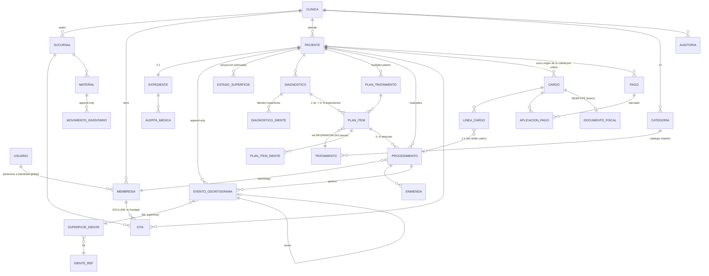

# Arquitectura de CLIDENT

> Documento canónico. Refleja las decisiones aprobadas en el Ciclo 0. Toda decisión estructural difícil de revertir tiene su ADR en `docs/ADR/`.
>
> Las reglas operativas obligatorias están en `CLAUDE.md`. Las reglas de negocio, en español para el propietario, están en `docs/REGLAS-DE-NEGOCIO.md`.

## Restricción rectora

El propietario **no es programador**. El sistema será mantenido principalmente por agentes de IA. Toda decisión se optimiza para arquitectura convencional, sin herramientas exóticas, sin sobreingeniería, sin dependencias innecesarias.

> **Principio rector:** se hace cumplir en la base de datos cuando el mecanismo es legible. Cuando el mecanismo de base de datos sería más confuso que el bug que previene, se hace en la aplicación y se prueba. **Excepción:** los invariantes de seguridad y de dinero se hacen cumplir en la base aunque cueste legibilidad, porque su lado malo no tiene techo.

---

# 1. Stack

| Pieza | Elección | Por qué |
|---|---|---|
| Framework | **Next.js (App Router)** | Un solo proyecto con frontend y backend. La combinación mejor documentada que existe: la que los agentes de IA mantienen con menos errores. |
| Lenguaje | **TypeScript** | Los errores de tipo son la red de seguridad más barata para un mantenedor no programador. |
| Base de datos | **PostgreSQL** | Integridad real: transacciones, `EXCLUDE`, RLS, `CHECK`, columnas generadas. Todo el diseño descansa en esto. |
| ORM | **Prisma 7** | Convencional, tipado, migraciones versionadas. Sus límites se cubren con SQL a mano (§9). |
| Hosting BD | **Neon** | PostgreSQL administrado con ramas, respaldos automáticos, sin servidor que mantener. |
| Hosting app | **Vercel** | Despliegue directo desde Git. |
| UI | **Tailwind + shadcn/ui** | Componentes copiados al repo, no una dependencia opaca. |
| Auth | **Auth.js** (credenciales + JWT) | Convencional. Versión fijada explícitamente. |
| Validación | **Zod** | Un esquema compartido cliente/servidor. |
| Pruebas | **Vitest** + PostgreSQL real | RLS y constraints no se pueden simular. |
| Package manager | **npm** | Ya presente. Sin Docker. |

**El stack son 8 piezas. Cada dependencia nueva requiere un ADR y autorización.**

---

# 2. Estructura de carpetas

```
clident/
├─ prisma/
│  ├─ schema.prisma
│  ├─ migrations/                  # incluye SQL escrito a mano (§9)
│  └─ seed/
│     ├─ dientes.ts                # deriva dientes_ref y superficies_diente
│     ├─ categorias.ts             # 12 categorías (plantillas globales)
│     └─ tratamientos.ts           # ~100 plantillas globales
├─ prisma.config.ts                # Prisma 7: la URL vive aquí, no en schema.prisma
├─ infra/
│  └─ bootstrap-roles.sql          # los roles de PostgreSQL (3 en Fase 1; el 4º con ADR-011)
├─ src/
│  ├─ app/
│  │  ├─ (auth)/login/ elegir-clinica/
│  │  ├─ (app)/                    # autenticado con clínica activa
│  │  │  ├─ dashboard/ agenda/ catalogo/ caja/ inventario/ configuracion/
│  │  │  └─ pacientes/[pacienteId]/
│  │  │     ├─ expediente/ odontograma/ diagnosticos/ planes/[planId]/
│  │  │     └─ procedimientos/ estado-cuenta/ historial/
│  │  └─ operador/                 # consola del operador — APLAZADA (ADR-011)
│  ├─ server/                      # SOLO servidor
│  │  ├─ db/                       # ÚNICO consumidor de Prisma
│  │  │  ├─ client.ts              # único lugar que construye PrismaClient
│  │  │  ├─ tenant.ts              # único lugar que toca set_config
│  │  │  ├─ operador.ts            # cliente Prisma del rol operador — APLAZADO (ADR-011)
│  │  │  ├─ raw/                   # ÚNICO lugar con $queryRaw
│  │  │  └─ pacientes.ts citas.ts odontograma.ts diagnosticos.ts
│  │  │     tratamientos.ts planes.ts procedimientos.ts caja.ts
│  │  │     inventario.ts membresias.ts auditoria.ts
│  │  ├─ auth/  context.ts permissions.ts config.ts
│  │  ├─ actions/                  # Server Actions, una por módulo
│  │  ├─ dto/                      # mappers DB → cliente (enmascarado)
│  │  ├─ odontograma/  reducer.ts rebuild.ts
│  │  ├─ operador/                 # flujos del operador — APLAZADO (ADR-011)
│  │  └─ billing/dte/  types.ts noop-provider.ts   # seam DTE, sin implementación
│  ├─ lib/
│  │  ├─ validation/               # Zod, compartido
│  │  └─ money.ts dui.ts dientes.ts errors.ts
│  ├─ components/  ui/ odontograma/ shared/
│  └─ types/
├─ tests/
│  ├─ unit/
│  └─ integration/                 # suites críticas (§17)
├─ docs/
│  ├─ ARQUITECTURA.md  REGLAS-DE-NEGOCIO.md  FLUJO-DE-DESARROLLO.md
│  └─ ADR/
└─ CLAUDE.md
```

**Reglas codificadas en la estructura, aplicadas por ESLint:**
- Importar `@prisma/client` fuera de `src/server/db/**` → error de build.
- Importar `src/server/db/operador.ts` fuera de `src/server/operador/**` → error de build. *(Llega con el módulo del operador — ADR-011.)*
- `$queryRaw` fuera de `src/server/db/raw/` → error de build.
- `$queryRawUnsafe` / `$executeRawUnsafe` en cualquier lado → error de build.

---

# 3. Multi-tenancy

## 3.1 Identidad y pertenencia

```
Usuario (identidad global: correo, contraseña)      ← SIN clinicaId
   └── Membresia (usuarioId + clinicaId + roles[])  ← única por par usuario-clínica
          └── Clinica                                ← el inquilino
                └── Sucursal                         ← "Sede principal" autocreada
```

Un profesional que trabaja en dos clínicas tiene **un usuario y dos membresías**, con roles potencialmente distintos en cada una. (ADR-003)

**El odontólogo no es una tabla aparte:** es una membresía que tiene `ODONTOLOGO` entre sus roles. Sus datos profesionales (número de JVPO, especialidad, color de agenda) viven en la membresía, porque son datos de esa persona *en esa clínica*.

**Consecuencia:** `odontologoId` referencia una **membresía**, no un usuario. Esto hace que el constraint de no-doble-booking quede aislado por clínica automáticamente.

## 3.2 Sucursal

`Sucursal` existe desde el día 1, con una fila "Sede principal" autocreada por clínica y **sin interfaz en el MVP**. (ADR-002)

**Lleva `sucursalId`:** citas, cargos, pagos, cortes de caja, inventario, procedimientos.
**No lleva:** paciente, expediente, odontograma, diagnósticos, planes. El paciente es de la clínica y se atiende en cualquier sede; su expediente lo sigue.

**Consecuencia:** la regla de no-doble-booking es **por odontólogo, no por sucursal**. Un dentista no puede estar en dos sedes a las 10:00.

## 3.3 Preparación SaaS (mínima)

`Clinica.estado` (`ACTIVA` | `SUSPENDIDA` | `PRUEBA`) + fecha de vigencia opcional. Permite cortar acceso por falta de pago sin integrar cobros.

**Fuera de alcance:** registro público, suscripciones, Stripe, planes, trials, onboarding automatizado. Se cuelgan de `Clinica` cuando existan clínicas pagando.

---

# 4. Aislamiento de inquilinos

## 4.1 Dos capas (ADR-001)

**Capa 1 — Repositorios con alcance explícito (primaria).**

```ts
export async function getPaciente(ctx: TenantContext, id: string) {
  // SIEMPRE clinicaId + id. NUNCA findUnique({ where: { id } }).
  const p = await db.paciente.findFirst({ where: { id, clinicaId: ctx.clinicaId } });
  if (!p) throw new AppError('NOT_FOUND');   // cross-tenant se ve igual que inexistente
  return p;
}
```

Se **descartó** una extensión de Prisma que inyectara `clinicaId` automáticamente: `db.paciente.findMany({})` *parece* un escaneo completo y un agente no puede saber leyendo esa línea si es seguro. Además falla en silencio con escrituras anidadas, `upsert` y SQL crudo. Una magia correcta el 95% del tiempo entrena a los agentes a dejar de pensar en el aislamiento.

**Capa 2 — Row Level Security de PostgreSQL (red de seguridad).** Con filtros explícitos, olvidar uno es posible. RLS convierte ese olvido en cero filas en vez de una filtración.

## 4.2 Roles de PostgreSQL

| Rol | Quién lo usa | Privilegios | Superusuario |
|---|---|---|---|
| `clident_migrator` | Solo migraciones en CI/CD | Dueño de tablas, DDL, políticas explícitas de mantenimiento; **sin `BYPASSRLS`** (ADR-015) | **No** |
| `clident_app` | Toda la aplicación en runtime | Solo DML. Sin DDL, sin `BYPASSRLS`, **no es dueño de nada** | **No** |
| `clident_operador` | Consola del operador | Angosto (§7) | **No** — *APLAZADO a la clínica #2 (ADR-011). En la Fase 1 el bootstrap lo hace `clident_migrator` a mano.* |
| `clident_readonly` | Diagnóstico | Solo `SELECT`, sujeto a RLS | **No** |

**Ninguno es superusuario.** En Supabase esto significaría no usar el rol `postgres`; en Neon, no usar el rol propietario por defecto para la aplicación.

**El default es RESTRICTIVO (ADR-012).** Una tabla nueva nace **solo legible**. Escribirle exige un `GRANT` explícito en su propia migración — que ya lleva SQL a mano obligatorio por el bloque de RLS, así que el costo marginal son dos líneas donde ya había diez.

```sql
REVOKE ALL ON SCHEMA public FROM PUBLIC;
GRANT USAGE ON SCHEMA public TO clident_app;       -- USAGE, nunca CREATE
GRANT USAGE ON SCHEMA public TO clident_readonly;  -- sin esto no lee NADA

-- DEFAULT INVERTIDO (ADR-012): una tabla nueva nace SOLO legible.
ALTER DEFAULT PRIVILEGES FOR ROLE clident_migrator IN SCHEMA public
  GRANT SELECT ON TABLES TO clident_app;
ALTER DEFAULT PRIVILEGES FOR ROLE clident_migrator IN SCHEMA public
  GRANT USAGE ON SEQUENCES TO clident_app;
ALTER DEFAULT PRIVILEGES FOR ROLE clident_migrator IN SCHEMA public
  GRANT SELECT ON TABLES TO clident_readonly;
```

> **Por qué el default se invirtió.** Este bloque antes decía `GRANT SELECT, INSERT, UPDATE, DELETE ON ALL TABLES`, con el comentario *"crítico: sin esto, cada tabla nueva rompe producción con permission denied"*. **Ese argumento estaba al revés.** Un `permission denied` en el primer `INSERT` es un fallo **ruidoso, inmediato y barato** — y con la prueba estructural de §4.2.4 ni siquiera llega a producción: falla el build. Un append-only ficticio es un fallo **silencioso y sin techo**: nadie se entera hasta que falta historia clínica. El principio rector del proyecto ordena exactamente esta preferencia.

## 4.2.1 Las seis clases de tabla — registro canónico

**Toda tabla pertenece a exactamente una clase.** La prueba estructural falla si aparece una tabla sin clasificar.

| Clase | `GRANT` a `clident_app` | Tablas |
|---|---|---|
| **APPEND_ONLY** | `SELECT, INSERT` | `eventos_odontograma`, `auditoria`, `movimientos_inventario`, `aplicaciones_pago`, `enmiendas_procedimiento`, `lineas_cargo`, `procedimiento_dientes`, `documentos_fiscales` |
| **REFERENCIA_GLOBAL** | `SELECT` (lo da el default) | `dientes_ref`, `superficies_diente`, `plantillas_categoria`, `plantillas_tratamiento` |
| **PUENTE_EDITABLE** | `SELECT, INSERT, DELETE` (sin `UPDATE`) | `diagnostico_dientes`, `plan_item_dientes` — las únicas dos con `DELETE` legítimo: editar los dientes de un borrador es delete+insert |
| **PROYECCION_DERIVADA** | `SELECT, INSERT, UPDATE, DELETE` | `estados_superficie` — derivada y regenerable; el rebuild y la anulación recalculada necesitan reescribirla |
| **PARCIALMENTE_INMUTABLE** | `SELECT, INSERT` + `GRANT UPDATE (columnas mutables)` | `procedimientos` (§10.5), `cargos`, `pagos` (§12.5), **`plan_items` (§10.6)** |
| **NORMAL** | `SELECT, INSERT, UPDATE` — **sin `DELETE`** | `pacientes`, `expedientes`, `alertas_medicas`, `citas`, `diagnosticos`, `planes`, `tratamientos`, `categorias_tratamiento`, `materiales`, `membresias`, `sucursales`, `clinicas`, `usuarios`, `contadores` |

**`DELETE` no se concede en ninguna parte salvo puentes y proyección.** Revisé todos los flujos documentados y ninguno lo necesita: las citas se cancelan, los planes se anulan, las membresías se desactivan, las sesiones son JWT sin tabla, y un `PlanItem` de un borrador pasa a `CANCELADO` en vez de borrarse.

> **`documentos_fiscales` nace APPEND_ONLY, desde la Fase 9.** Un primer borrador la puso en NORMAL "hasta que exista el DTE" — mal: la tabla se crea vacía en la Fase 9 y el proveedor DTE **no está en ninguna fase del plan**, así que "cuando exista" no llega nunca dentro del alcance escrito, y mientras tanto una tabla de **snapshots tributarios** —declarada inmutable por §12.7 y §19 con el argumento del ADR-006— viviría con `UPDATE` concedido. Es el mismo defecto que `permitePlanDePagos`: una promesa esperando al agente que la lea en seis meses. Si algún día el DTE necesita escribir un sello que devuelve Hacienda, se mueve a PARCIALMENTE_INMUTABLE con `GRANT UPDATE (sello_recepcion, estado_dte)` — el mecanismo ya está construido.

## 4.2.2 Privilegios por columna: el orden importa

```sql
-- 1º REVOCAR a nivel de tabla. 2º CONCEDER por columna. NUNCA al revés.
REVOKE UPDATE ON procedimientos FROM clident_app;
GRANT UPDATE (estado, notas_clinicas, anulado_en, anulado_por_id,
              motivo_anulacion, actualizado_en)
  ON procedimientos TO clident_app;
```

**Dos hechos de PostgreSQL de los que depende todo esto** (documentación oficial, `sql-revoke`):

1. > *"if a role has been granted privileges on a table, then revoking the same privileges from individual columns will have no effect."*

   **Un `REVOKE UPDATE (columna)` sobre un rol que tiene `UPDATE` de tabla no hace absolutamente nada.** El privilegio por columna solo restringe cuando es la **única** fuente del privilegio. Por eso hay que quitar primero el de tabla.

2. > *"When revoking privileges on a table, the corresponding column privileges (if any) are automatically revoked on each column of the table, as well."*

   **Revocar a nivel de tabla borra también los grants por columna.** Si se hace en el orden inverso, el `GRANT` por columna se pierde en silencio.

> **⚠ Trampa de Prisma:** `actualizado_en` (`@updatedAt`) **debe** estar en el `GRANT`. Prisma la escribe en **todo** `UPDATE`; si falta, cada actualización falla con *permission denied* y el error apunta a la columna equivocada.

## 4.2.3 Qué NO protege este modelo

**`clident_migrator` es dueño de las tablas y puede reconcederse cualquier privilegio.** Ningún `REVOKE` lo ata; lo único que lo alcanza es RLS con `FORCE`.

**Este modelo protege contra la aplicación y sus agentes, no contra las migraciones.** Eso ya es la postura del proyecto —`MIGRATION_DATABASE_URL` vive solo en CI y nunca en runtime (§4.4)— pero hay que decirlo explícito: **ningún agente debe creer que el append-only ata al migrator.** Ata a `clident_app`, que es quien corre en producción.

## 4.2.4 La prueba estructural de privilegios

Espejo de la prueba estructural de RLS. Un registro canónico en `tests/integration/estructura-privilegios.test.ts` con la clase de cada tabla, y aserciones contra el catálogo:

```sql
-- 1. Toda tabla de public debe estar clasificada. `_prisma_migrations` es de Prisma:
--    va en la lista de exclusión explícita, no se ignora en silencio.
SELECT tablename FROM pg_tables WHERE schemaname = 'public'
EXCEPT SELECT unnest($tablasClasificadas || $tablasExcluidas);   -- cero filas o falla el build

-- 2. Los privilegios REALES de cada tabla == exactamente los que su clase declara.
--    Se DERIVA de la clase; no es una lista escrita a mano.
--    Por cada tabla clasificada y cada verbo (SELECT/INSERT/UPDATE/DELETE/TRUNCATE):
SELECT has_table_privilege('clident_app', $tabla, $verbo) = ($verbo = ANY($verbosDeSuClase));

-- 3. Ninguna columna de una tabla append-only es actualizable — POR NINGUNA VÍA.
--    Itera information_schema.columns; NO usa table_privileges (ver abajo).
SELECT has_column_privilege('clident_app', $tablaAppendOnly, $columna, 'UPDATE');  -- false

-- 4. Toda columna declarada INMUTABLE en §10.5 y §12.5 → has_column_privilege = false.
-- 5. clident_readonly: SELECT y nada más, en toda tabla.
-- 6. Ningún rol de aplicación es superusuario ni tiene BYPASSRLS (pg_roles).
```

**`has_column_privilege()` es la clave, y hay que usarla en TODAS las aserciones de escritura.** Devuelve `true` si el privilegio llega por **cualquier** vía, tabla o columna.

> **⚠ Nunca uses `information_schema.table_privileges` para verificar que algo NO se puede escribir.** Esa vista **solo lista privilegios concedidos a nivel de tabla**; los grants por columna viven en `column_privileges`. El primer borrador de esta prueba usaba `table_privileges` para verificar las append-only — y **tenía exactamente el punto ciego del bug que vino a cazar**: un `GRANT UPDATE (motivo_reversa) ON aplicaciones_pago` no aparecería, la prueba pasaría en verde, y la tabla quedaría actualizable. Es la imagen especular del `REVOKE UPDATE (columna)` decorativo: allá el privilegio por columna no restringía; acá no se veía.

**Que la aserción #2 se DERIVE de la clase es lo que hace real al registro de §4.2.1.** Una lista de tablas escrita a mano en la prueba es prosa con otro disfraz: el día que alguien agregue `radiografias` como NORMAL y su migración le conceda `DELETE`, una lista hardcodeada no la contiene y el build pasa en verde con `DELETE` sobre imágenes clínicas.

## 4.3 FORCE ROW LEVEL SECURITY

```sql
ALTER TABLE pacientes ENABLE ROW LEVEL SECURITY;
ALTER TABLE pacientes FORCE  ROW LEVEL SECURITY;

CREATE POLICY tenant_isolation ON pacientes
  USING      (clinica_id = NULLIF(current_setting('app.clinica_id', true), ''))
  WITH CHECK (clinica_id = NULLIF(current_setting('app.clinica_id', true), ''));
```

`ENABLE` por sí solo **no aplica las políticas al dueño de la tabla ni a superusuarios**. Sin `FORCE`, si la aplicación llegara a conectarse con el rol dueño, todas las clínicas quedan expuestas en silencio. Con `FORCE`, el mismo error se manifiesta como cero filas. Costo: cero en runtime.

El `WITH CHECK` es tan importante como el `USING`: sin él, un `INSERT` podría escribir filas en otra clínica.

**Falla cerrado:** sin GUC, `columna = NULL` → `NULL` → no true → cero filas.

## 4.4 Separación de credenciales

- `DATABASE_URL` (`clident_app`) → variables de Vercel. Única que la aplicación conoce.
- `MIGRATION_DATABASE_URL` (`clident_migrator`) → **solo secreto de GitHub Actions**. Nunca en Vercel.
- Migraciones = paso del pipeline. Nunca un endpoint.
- El arranque valida con Zod y **aborta** si detecta `MIGRATION_DATABASE_URL` en runtime.

**Ningún endpoint puede usar el rol de migraciones porque la credencial no existe en su entorno.** No se guarda la llave de la caja fuerte dentro de la caja fuerte.

## 4.5 El footgun

```sql
SELECT set_config('app.clinica_id', $1, true);  -- true = LOCAL a la transacción
```

Con `SET` de sesión y pooler en modo transacción (Neon lo usa), la conexión se recicla entre requests **conservando la clínica anterior**: filtración intermitente, irreproducible, sin error.

**`src/server/db/tenant.ts` es el único archivo que toca `set_config`**, y envuelve cada operación en transacción interactiva.

---

# 5. Integridad referencial: FK compuestas (ADR-004)

`clinicaId` en ambas tablas **no impide nada**: una `Cita` de la Clínica A apuntando a un `Paciente` de la B produce dos filas internamente coherentes. Ni RLS ni la aplicación lo detectan.

## 5.1 La regla

1. Toda tabla de inquilino lleva `@@unique([clinicaId, id])`.
2. Toda relación entre tablas de inquilino usa FK compuesta `[clinicaId, xId] → [clinicaId, id]`, con `@relation("nombre")`.
3. `onUpdate: Restrict` explícito (Prisma pone `CASCADE`, que arrastraría al hijo a otra clínica).

**Verificado empíricamente contra Prisma 7.8.0** — genera ambas FK compuestas aunque compartan la columna `clinicaId`:

```
Cita_clinicaId_pacienteId_fkey    FOREIGN KEY ("clinicaId","pacienteId")   REFERENCES "Paciente"("clinicaId","id")
Cita_clinicaId_odontologoId_fkey  FOREIGN KEY ("clinicaId","odontologoId") REFERENCES "Membresia"("clinicaId","id")
```

## 5.2 Propiedad emergente

Como el `clinicaId` del hijo **participa en la FK**, la clínica del hijo y la del padre **son la misma columna**: no se validan, no pueden diferir. Encadena (`PlanItem → Plan → Paciente`) y hace imposible **mover** una fila de clínica.

## 5.3 Excepciones (FK simple)

| Relación | Razón |
|---|---|
| `X.clinicaId → Clinica.id` | `Clinica` es el inquilino; una compuesta sería `[clinicaId, clinicaId]` |
| `Membresia.usuarioId → Usuario.id` | `Usuario` es global **por diseño**: es donde una identidad cruza clínicas |
| `Auditoria.usuarioId → Usuario.id` | Igual |
| `*.[fdi, superficie] → SuperficieDiente` | Tabla global inmutable, sin inquilino que filtrar |
| Plantillas del catálogo | Globales |

**Costo:** cada FK compuesta exige un índice `(clinicaId, x)` — exactamente el que las consultas de inquilino ya necesitaban. Costo neto ≈ 0.

---

# 6. Bootstrap multi-clínica

## 6.1 El problema

RLS exige `app.clinica_id`, pero el login debe consultar `membresias` **antes** de que exista una clínica activa.

## 6.2 Dos GUCs, sin bypass

```sql
SELECT set_config('app.usuario_id', $1, true);   -- apenas autenticado
SELECT set_config('app.clinica_id', $2, true);   -- solo tras elegir clínica

CREATE POLICY membresia_visible ON membresias FOR SELECT
USING (
  clinica_id = NULLIF(current_setting('app.clinica_id', true), '')
  OR usuario_id = NULLIF(current_setting('app.usuario_id', true), '')
);
```

Siempre podés ver **tus propias** membresías sin clínica activa; y todas las de la clínica activa (el permiso fino es de aplicación — **RLS es el piso, no el techo**).

## 6.3 Flujo de login

1. `POST /login` (anónimo, rate-limited) con correo + contraseña.
2. Buscar `Usuario` por correo, verificar hash argon2id.
3. JWT firmado con **`usuarioId` solamente**. Sin `clinicaId`.
4. `/elegir-clinica`: se fija **solo** `app.usuario_id`; se listan las membresías activas con su clínica, excluyendo `SUSPENDIDA`.
5. 0 membresías → error. 1 → autoselección. >1 → selector.
6. `POST /elegir-clinica`: el servidor **revalida** membresía activa + clínica `ACTIVA|PRUEBA`. Recién ahí `clinicaId` entra en la sesión.
7. Cada request: `requireCtx()` **relee `Membresia` + `Clinica.estado`** (consulta indexada; **no cachear**) y fija ambos GUCs.

**El `clinicaId` de la sesión nunca se cree por sí solo.** El JWT está firmado, pero puede quedar obsoleto: la relectura por request es lo que hace efectivas la revocación de membresía y la suspensión de clínica.

## 6.4 Dos contextos

```ts
type AuthContext   = { usuarioId: string };                                  // post-login, pre-clínica
type TenantContext = AuthContext & { clinicaId, membresiaId, roles, sucursalId? };

requireAuth(): AuthContext     // solo /elegir-clinica
requireCtx():  TenantContext   // todo lo demás
```

**Exactamente una función del proyecto acepta `AuthContext`:** `listarMisMembresias(auth)`. Todos los repositorios exigen `TenantContext`.

## 6.5 Excepción aceptada: `usuarios` sin RLS

`usuarios` no tiene `clinicaId` → no lleva RLS. El login debe buscar por correo antes de que exista identidad; no hay política que lo permita sin permitir todo.

Se descartó una función `SECURITY DEFINER` que verificara la contraseña dentro de PostgreSQL: mueve el hashing a SQL, es poco convencional para Next.js y agrega una función que los agentes tendrían que mantener.

**Mitigación:** la tabla contiene correo, nombre y hash argon2id — ningún dato clínico. Acceso confinado por ESLint a `src/server/auth/`. **Riesgo residual aceptado y documentado:** enumerar qué correos existen en CLIDENT.

---

# 7. Operador de plataforma

> **APLAZADO hasta que exista la clínica #2 (ADR-011, Ciclo 1).** Esta sección es **diseño aprobado, no alcance de la Fase 1.** Se implementa completa cuando haya un segundo cliente.
>
> **Qué hace la Fase 1 mientras tanto:** un script de bootstrap (`infra/crear-clinica.sql` o equivalente) corrido a mano con `clident_migrator` — el rol de migraciones, que ya existe, ya está fuera de Vercel y ya sabe crear cosas. Ejecuta los mismos flujos de abajo, sin consola y sin cuarto rol.
>
> **Por qué se aplazó:** hoy el operador es Carlos, la única clínica es la suya, y el expediente que el operador no puede leer es el suyo propio. Es maquinaria contra una amenaza que todavía no existe, en la fase que ya es la más grande del plan. `FLUJO-DE-DESARROLLO.md` §7 recomienda entregar 1→2→3 y usar la agenda con una clínica real antes de seguir; la consola del operador no acerca a eso.
>
> **Qué NO se construye en la Fase 1:** el rol `clident_operador`, `OPERATOR_DATABASE_URL`, `src/server/db/operador.ts`, la regla de ESLint que restringe su import, las políticas `TO clident_operador`, el árbol `/operador/*` y su guard.
>
> **Lo que sí se conserva desde el día uno**, porque quitarlo después costaría una migración: `Usuario.esOperadorPlataforma` y `Clinica.estado`. Son columnas, cuestan cero, y son de lo que el modelo necesita igual.

`clident_operador` — **no superusuario, sin `BYPASSRLS`, no dueño de nada.**

| Tabla | Privilegio | Política |
|---|---|---|
| `clinicas`, `sucursales`, `membresias` | SELECT, INSERT, UPDATE | `TO clident_operador USING (true) WITH CHECK (true)` |
| `usuarios`, `contadores` | SELECT, INSERT, UPDATE | (sin RLS) |
| `plantillas_categoria`, `plantillas_tratamiento` | SELECT | (globales) |
| `categorias_tratamiento`, `tratamientos` | **solo INSERT** | `FOR INSERT WITH CHECK (true)` — **sin `USING`** |
| `auditoria` | INSERT | — |
| `pacientes`, `expedientes`, `eventos_odontograma`, `estados_superficie`, `diagnosticos`, `planes`, `plan_items`, `procedimientos`, `citas`, `cargos`, `pagos`, `materiales` | **NINGUNO** | — |

**El operador no puede leer un solo expediente — no por política, sino por ausencia de privilegio.** No hay bypass general: hay políticas `TO clident_operador` sobre 4 tablas de plataforma, visibles en SQL.

**INSERT sin SELECT sobre el catálogo:** puede sembrar el catálogo de una clínica nueva leyendo las **plantillas globales**, pero **no puede leer el catálogo ni los precios de ninguna clínica**.

**Cableado:** `OPERATOR_DATABASE_URL`, cliente Prisma separado en `src/server/db/operador.ts`, ESLint restringe su import a `src/server/operador/**`, rutas bajo `/operador/*`, guard sobre `Usuario.esOperadorPlataforma`.

**Flujos:**
- **Crear clínica** (una transacción, Fase 1): `Clinica(estado=PRUEBA)` → `Sucursal("Sede principal")` → buscar-o-crear `Usuario` → `Membresia(roles=[ADMINISTRADOR])` → `Auditoria`. El catálogo se clona en la Fase 4, cuando sus tablas existen (ADR-015).
- **Invitar admin:** usuario sin contraseña + token de un solo uso → `/establecer-contrasena`.
- **Suspender / reactivar:** `UPDATE clinicas SET estado='SUSPENDIDA'`. Como `requireCtx()` lee `Clinica.estado` por request, los usuarios quedan fuera en su siguiente request. Sin revocación de tokens, sin job.

---

# 8. Roles y permisos (ADR-003)

```ts
export const PERMISOS_POR_ROL: Record<Rol, readonly Permiso[]> = {
  ADMINISTRADOR: [/* todos */],
  ODONTOLOGO: ['agenda:read','agenda:write','paciente:read','paciente:write','paciente:read_pii',
               'clinico:read','clinico:write','catalogo:read','caja:read','inventario:read'],
  RECEPCION:  ['agenda:read','agenda:write','paciente:read','paciente:write','catalogo:read'],
  //          sin clinico:*, sin paciente:read_pii → ve DUI enmascarado y NADA clínico
  CAJA:       ['agenda:read','paciente:read','paciente:read_pii','catalogo:read',
               'caja:read','caja:write','inventario:read'],
} as const;
```

**`Membresia.roles Rol[]`** — arreglo de enum nativo de PostgreSQL. Múltiples roles simples por membresía. **No** rol único, **no** tabla puente, **no** motor ACL configurable.

`ADMINISTRADOR + ODONTOLOGO` es la clínica salvadoreña típica (el dueño es odontólogo).

```sql
ALTER TABLE membresias ADD CONSTRAINT membresia_con_rol
  CHECK (cardinality(roles) >= 1 AND array_position(roles, NULL) IS NULL);
CREATE INDEX ON membresias USING gin (roles);   -- consultar: roles @> ARRAY['ODONTOLOGO']::rol[]
```

Resolución de permisos = unión: `roles.flatMap(r => PERMISOS_POR_ROL[r])`.

**Verificación en el servidor, primera línea de cada función de repositorio.** No en la UI, no en middleware. La UI además esconde lo prohibido, pero eso es cosmética.

**Regla que NO se hace cumplir en la base (excepción consciente):** `odontologoId` debería apuntar a una membresía con rol `ODONTOLOGO`. PostgreSQL no lo puede expresar en una FK. Se descartó el truco de columna generada + FK de tres columnas: el mecanismo sería más confuso que el bug, y el bug es de dropdown equivocado (filtrado en servidor), no una fuga ni un error de dinero. **Verificación en el repositorio + prueba.**

---

# 9. Migraciones

**`prisma db push` está PROHIBIDO.** Borra en silencio el `EXCLUDE`, las políticas RLS, la columna generada y los `CHECK`. La aplicación sigue pareciendo que funciona mientras el doble booking vuelve a ser posible.

**Flujo obligatorio:**
```
npx prisma migrate dev --create-only    # genera el archivo
# editar migration.sql a mano
npx prisma migrate dev                  # aplica (desarrollo)
npx prisma migrate deploy               # aplica (CI/producción, rol migrator)
```

## Lo que requiere SQL escrito a mano

| Fase | Migración | Por qué Prisma no puede |
|---|---|---|
| 1 | `ENABLE`/`FORCE ROW LEVEL SECURITY` + políticas | No expresa RLS |
| 1 | **Default restrictivo** (`ALTER DEFAULT PRIVILEGES ... GRANT SELECT`) + `GRANT`/`REVOKE` por clase de tabla (§4.2.1) | No gestiona privilegios |
| 1 | `CHECK` de `membresia_con_rol`; índice GIN | No expresa `CHECK` |
| 2 | `CREATE EXTENSION btree_gist` + **dos** `EXCLUDE` (odontólogo y paciente) + `CHECK` de rango | No expresa `EXCLUDE` |
| 3 | Columna generada `dui_enmascarado` + `CHECK` de formato + `CHECK` de responsable completo | No expresa columnas generadas |
| 8 | `REVOKE UPDATE ON procedimientos` **y después** `GRANT UPDATE (columnas mutables)` (§10.5, §4.2.2) | No gestiona privilegios |
| 9 | `REVOKE`/`GRANT` por columna en `cargos` y `pagos` (§12.5); columna generada `monto_negado_centavos` + FK de reversa (§12.4); `CHECK` de sobreaplicación (**en `cargos` y en `pagos`**), de monto positivo (**en las dos**), de coherencia de estado (`cargos`) y de anulación coherente (`pagos`); `fecha_exigible_en` con zona explícita (§12.6) | No expresa `CHECK`, ni columnas generadas, ni privilegios |

**No hay migraciones destructivas en todo el plan:** el proyecto arranca sin datos y cada fase agrega tablas sin alterar las anteriores.

## Prisma 7

La URL **no** va en `schema.prisma`. Va en `prisma.config.ts`:

```ts
import { defineConfig } from 'prisma/config';
export default defineConfig({
  schema: './prisma/schema.prisma',
  migrations: { path: './prisma/migrations' },
});
```

**Riesgo #1 del proyecto:** las migraciones SQL manuales son toda la historia de seguridad y Prisma no sabe que existen. Mitigación: `db push` prohibido en tres lugares y **no existe el script en `package.json`**; las pruebas de solapamiento y la estructural de RLS fallan ruidosamente si falta el constraint; aserción en CI que consulta `pg_constraint`.

---

# 10. Modelo clínico

## 10.1 Odontograma: eventos append-only + proyección (ADR-005)

**Fuente de verdad:** un log append-only de eventos clínicos. **Además**, una tabla de proyección con el estado actual, mantenida en la misma transacción.

No es event sourcing puro (sin agregados, sin replay en lectura, sin bus). No es estado mutable + tabla de historial.

- **El camino destructivo debe ser estructuralmente inexistente.** Con una tabla mutable, un `update()` de aspecto razonable escrito dentro de seis meses borra historia clínica **y se ve correcto en la revisión**. Con append-only no existe el verbo `update`.
- **El expediente es un documento legal.** Append-only + quién/cuándo/por qué es la postura defendible.
- **La proyección lo mantiene aburrido:** el estado actual es un `SELECT` indexado normal.

```
EventoOdontograma   (append-only)  clinicaId, pacienteId, fdi, superficie, tipo,
                                   condicion?, ocurridoEn (clínica), creadoEn (captura),
                                   registradoPorId, diagnosticoId?, planItemId?,
                                   procedimientoId?, anulaEventoId?, motivoAnulacion?

EstadoSuperficie    (proyección)   @@unique([clinicaId, pacienteId, fdi, superficie])
                                   condicion, tratamientoPendiente, ultimoEventoId,
                                   ultimoEventoEn, ultimoEventoCreadoEn
```

**Tipos de evento:** `CONDICION_REGISTRADA`, `TRATAMIENTO_INDICADO`, `PROCEDIMIENTO_REALIZADO`, `CONDICION_ANULADA`.

- **`Superficie.COMPLETO` centinela** en vez de superficie nulable: mantiene el `@@unique` realmente único (en PostgreSQL los `NULL` no colisionan).
- **Un evento por (diente, superficie).** Caries en 26 mesial+oclusal = 2 eventos con el mismo `diagnosticoId`. La UI agrupa; el modelo se mantiene plano.
- **Correcciones vía `CONDICION_ANULADA` + `anulaEventoId`**, nunca borrado. El reducer salta los anulados.
- **Regla del reducer:** gana el último evento no anulado por `(ocurridoEn, creadoEn)`.
- El `switch` del reducer **no tiene `default`**: un tipo de evento nuevo sin su rama es **error de compilación**.
- La proyección es **derivada, nunca autoritativa**. `npm run odontograma:rebuild` la regenera.

### Cómo se actualiza la proyección — dos caminos, no uno

**Tres de los cuatro tipos de evento *agregan* información**, y para ellos la proyección se actualiza con un `UPDATE` condicional (§13.3):

```sql
UPDATE estados_superficie SET ...
WHERE ... AND (ultimo_evento_en, ultimo_evento_creado_en) <= ($ocurridoEn, $creadoEn)
```

**`CONDICION_ANULADA` NO se puede proyectar así, y es la trampa más fácil de caer de la Fase 6.** Al anular "caries en 26 oclusal", el estado correcto de esa superficie **no sale del evento de anulación** — sale del **último evento no anulado anterior**, que puede ser otra condición, puede ser "sano", o puede no existir. El evento de anulación no lleva esa información encima. Un `UPDATE` con sus datos deja el diente mostrando la condición anulada, o —peor— mostrando "anulada" como si fuera un diagnóstico. **Falla en silencio y es clínico: el paciente ve un diente pintado mal.**

**Regla:** `CONDICION_ANULADA` **recalcula** esa `(fdi, superficie)` plegando su historia completa con el mismo reducer del rebuild. No es un `UPDATE` incremental. Es el único tipo de evento que se proyecta así.

### Criterio de desempate: uno solo, en los dos caminos

El camino en vivo y el camino de `rebuild()` son **dos implementaciones distintas de la misma pregunta** ("¿qué evento gana?"), y por eso pueden divergir. Para que no diverjan, el criterio de orden es **`(ocurridoEn, creadoEn)` en ambos**. Por eso `EstadoSuperficie` guarda los dos campos —`ultimoEventoEn` **y** `ultimoEventoCreadoEn`— y el `UPDATE` condicional compara la tupla completa:

```sql
WHERE (ultimo_evento_en, ultimo_evento_creado_en) <= ($ocurridoEn, $creadoEn)
```

Con un solo campo, dos eventos del mismo día se desempatan por orden de commit en vivo y por `creadoEn` en el rebuild: **criterios distintos, resultados distintos.**

### La prueba que hace segura la proyección

**No es "`rebuild()` es idempotente".** Idempotencia es `rebuild(rebuild(x)) == rebuild(x)` — o sea, el reducer consistente consigo mismo. Es casi imposible que falle y no prueba nada útil: no detecta que el camino en vivo y el reducer discrepen, que es el riesgo real.

**La prueba correcta es la de equivalencia entre caminos:**

> escribir una secuencia de eventos por el camino normal —incluyendo **un evento retroactivo y una anulación**— → correr `rebuild()` → **afirmar que la proyección no cambió**.

Ésa atrapa el hueco de `CONDICION_ANULADA`, la divergencia de desempate, y cualquier otra que aparezca después.

## 10.2 DienteRef y superficies válidas (ADR-005)

**Tabla global `dientes_ref`**, sin `clinicaId`, semilla fija, FK desde las entidades clínicas, **no editable por las clínicas**.

Sin la tabla no hay FK, y sin FK un `fdi` inválido (19, 29, 56) solo lo atrapa la validación de aplicación.

**"No editable" se implementa como privilegio:** `clident_app` recibe **solo `SELECT`**.

**Una sola fuente de los datos:**

| Artefacto | Rol |
|---|---|
| `src/lib/dientes.ts` | **Fuente de verdad de los datos.** 52 entradas tipadas. La UI la usa para el SVG y la aritmética de cuadrantes/sextantes. |
| `prisma/seed/dientes.ts` | **Deriva** la tabla del archivo anterior. |
| Tabla `dientes_ref` | **Proyección en la base; existe para que haya FK.** |
| Prueba | Afirma que tabla == constantes. |

**`superficies_diente`** (global, 312 filas: seis por cada uno de los 52 dientes; PK `[fdi, superficie]`, `COMPLETO` para todos). FK `[fdi, superficie]` desde `EventoOdontograma`, `EstadoSuperficie`, `DiagnosticoDiente`, `PlanItemDiente`, `ProcedimientoDiente`.

Hace **imposible** registrar "caries oclusal en el incisivo 11". Reemplaza la FK directa a `dientes_ref.fdi` (queda transitiva) y elimina la lógica de `esAnterior` dispersa en el código.

## 10.3 Diagnósticos

Separados de los tratamientos. `Diagnostico` 1 → **0..N** `PlanItem`. Pulpitis en el 26 → endodoncia + reconstrucción + corona.

`DiagnosticoDiente` cubre multi-diente y multi-superficie con una sola tabla. Un diagnóstico de paciente (`alcance = PACIENTE`, ej. bruxismo) simplemente tiene cero filas. Misma tabla, sin caso especial.

## 10.4 Catálogo

`Tratamiento` **no tiene columna de superficie**. Las superficies existen solo en `PlanItemDiente` y `ProcedimientoDiente`. **Literalmente no hay dónde poner "resina oclusal" como fila del catálogo** — eso es la garantía, no una regla de revisión.

Banderas de comportamiento: `requiereDiente`, `permiteMultiplesDientes`, `permiteSuperficies`, `permiteMultiplesSuperficies`, `requiereDiagnostico`, `permiteMultiplesSesiones`, `alcance`.

> **`permitePlanDePagos` se quitó en el Ciclo 1.** Era una bandera booleana **sin ningún mecanismo detrás**, en un diseño donde los planes de pago no estaban modelados — una trampa para el agente que la viera en seis meses y la implementara como se le ocurriera. El mecanismo real de las cuotas vive en Caja: un humano crea N cargos con `fechaExigibleEn` (§12.6, ADR-013). El catálogo no tiene nada que decir al respecto.

**Copiado por clínica** al crearla (`clonarCatalogo`), desde plantillas globales. Un catálogo global + tabla de sobreescrituras duplicaría cada ruta de lectura.

## 10.5 Procedimientos

**Inmutable tras crearse:** `realizadoEn`, `precioAplicadoCentavos`, `tratamientoId`, dientes y superficies.

**"Inmutable" es un privilegio de PostgreSQL, no una convención.** `procedimientos` **no puede** ser append-only —necesita `UPDATE` para la nota clínica de 12 h y para pasar a `ANULADO`—, así que es **PARCIALMENTE_INMUTABLE** (§4.2.1): se le quita `UPDATE` de tabla y se le devuelve solo sobre las columnas mutables. Sin eso, "inmutable" sería exactamente el tipo de regla que este proyecto existe para no tener: una convención que un agente viola con un `update` que se ve razonable en la revisión. Y es **dinero**, o sea que el principio rector exige hacerla cumplir en la base aunque cueste legibilidad.

```sql
-- Fase 8. El orden NO es negociable (§4.2.2).
REVOKE UPDATE ON procedimientos FROM clident_app;
GRANT UPDATE (estado, notas_clinicas, anulado_en, anulado_por_id,
              motivo_anulacion, actualizado_en)
  ON procedimientos TO clident_app;
```

### Lista canónica de columnas de `Procedimiento`

**Esta lista es la fuente de verdad.** El esquema nace de ella, y la prueba estructural (§4.2.4) la verifica columna por columna.

| Columna | | Por qué |
|---|---|---|
| `id` | **INMUTABLE** | PK |
| `clinicaId` | **INMUTABLE** | doble candado: sin `UPDATE` **y** las FK compuestas lo rechazarían (ADR-004) |
| `sucursalId` | **INMUTABLE** | dónde ocurrió es un hecho histórico |
| `pacienteId` | **INMUTABLE** | mover un hecho clínico a otro paciente es reescribir historia |
| `planItemId` | **INMUTABLE** | determina el tratamiento y el eventual precio de sesión (#10) |
| `odontologoId` | **INMUTABLE** | quién lo hizo es un hecho legal del expediente |
| `tratamientoId`, `tratamientoNombre`, `tratamientoCodigo` | **INMUTABLE** | snapshots (ADR-006) |
| `realizadoEn` | **INMUTABLE** | hecho clínico |
| `precioAplicadoCentavos` | **INMUTABLE** | es dinero |
| `creadoEn`, `creadoPorId` | **INMUTABLE** | procedencia |
| `estado` | **MUTABLE** | `REALIZADO → ANULADO`, amarrado por el `CHECK` de abajo |
| `notasClinicas` | **MUTABLE** | ventana de gracia de 12 h |
| `anuladoEn`, `anuladoPorId`, `motivoAnulacion` | **MUTABLE** | `NULL` → valor, una sola vez |
| `actualizadoEn` | **MUTABLE** | **obligatoria en el `GRANT`**: Prisma la escribe en todo `UPDATE` (§4.2.2) |

```sql
ALTER TABLE procedimientos ADD CONSTRAINT procedimiento_estado_coherente CHECK (
  (anulado_en IS NULL     AND estado <> 'ANULADO') OR
  (anulado_en IS NOT NULL AND estado = 'ANULADO'
     AND anulado_por_id IS NOT NULL AND motivo_anulacion IS NOT NULL)
);
```

**Dos límites declarados, no resueltos:**
- **La ventana de 12 h no es expresable** ni por privilegio ni por `CHECK` (un `CHECK` no puede usar `now()` de forma útil). Vive en la aplicación, con prueba. Excepción consciente: no es dinero.
- **"Des-anular" es posible a nivel de privilegios, y NO solo acá.** `anulado_en` es mutable en `procedimientos`, **y también en `cargos` y en `pagos`** (§12.5). Un `CHECK` es de fila: no compara la vieja contra la nueva, así que **no puede** impedir volver `anulado_en` a `NULL`. Solo un trigger lo impediría, y el proyecto no usa triggers.

  > **El lado financiero NO está protegido.** Un `UPDATE pagos SET anulado_en = NULL, ...` satisface `pago_anulado_coherente` sin chistar (primera rama), y **resucita el crédito a favor de un cheque que rebotó** — exactamente la plata inventada que §12.4 dice impedir. Lo mismo con `cargos`: `ANULADO → PENDIENTE` con `anulado_en = NULL` y `aplicado = 0` satisface `cargo_estado_coherente` y **revive una deuda cancelada**. Es **decisión pendiente #12**, y es de dinero, no de conveniencia clínica.
  >
  > **Alternativa a evaluar con #12** (encaja con la filosofía del proyecto y no necesita triggers): mover la anulación a una **tabla append-only** (`anulaciones_cargo`, `anulaciones_pago`, `anulaciones_procedimiento`) con `@@unique([clinicaId, cargoId])`. "Anulado" pasa a ser *"existe una fila"*, y como append-only no tiene `DELETE`, **des-anular se vuelve estructuralmente imposible** — la misma jugada que el odontograma. Cuesta reescribir los `CHECK` de coherencia, que hoy leen `anulado_en`.

`procedimiento_dientes` es **APPEND_ONLY** (`SELECT` + `INSERT`). Sin `UPDATE` **y sin `DELETE`**: con cualquiera de los dos se podría cambiar qué dientes cubrió un procedimiento, que es justo lo que esta sección declara inmutable. Un diente mal registrado se corrige anulando el procedimiento y volviéndolo a crear.

**Tercer límite declarado:** append-only impide **quitar** y **modificar** dientes, pero no impide **agregar** uno a un procedimiento viejo — el `INSERT` hace falta al crearlo y los privilegios no distinguen "al crear" de "seis meses después". Prevenirlo exigiría un trigger. **Es el residuo aceptado:** agregar un diente es visible en el historial y mucho menos grave que borrarlo, que es lo que sí queda cerrado.

- **Sin borrado físico.** Solo `anularProcedimiento(ctx, id, motivo)` → `ANULADO` + auditoría + evento compensatorio.
- **Ventana de gracia:** `notasClinicas` editable por su autor durante 12 h. Después, `EnmiendaProcedimiento` preserva el texto anterior.
- Un procedimiento **cobrado** no se puede anular sin anular antes el cargo.

---

## 10.6 Planes: `PlanTratamiento` y `PlanItem` (ADR-014)

**Los enums y sus transiciones son canónicos y viven en `REGLAS-DE-NEGOCIO.md` §4.4 y §4.5.** Acá va lo que el esquema necesita.

- `PlanTratamiento.estado`: `BORRADOR` | `PRESENTADO` | `ACEPTADO` | `RECHAZADO` | `ANULADO`
- `PlanItem.estado`: `PROPUESTO` | `ACEPTADO` | `EN_PROCESO` | `COMPLETADO` | `CANCELADO`

**`PROGRAMADO` no existe** — la programación vive en Agenda, no en el estado clínico. El seam `PlanItem ↔ Cita` queda abierto y **no se implementa** (ADR-014).

### `plan_items` es PARCIALMENTE_INMUTABLE — lista canónica

**`PlanItem` guarda el precio congelado, y eso es dinero.** El ADR-006 lo protege del **join** al catálogo; **no lo protegía del `UPDATE` directo.** Hasta el Ciclo 1, `plan_items` estaba en la clase NORMAL: `precio_unitario_centavos` era escribible, mientras `cargos.monto_centavos` y `procedimientos.precio_aplicado_centavos` ya estaban cerrados por privilegio. **El principio rector se había aplicado a dos de las tres tablas de dinero.**

```sql
-- Fase 7. El orden no es negociable (§4.2.2).
REVOKE UPDATE ON plan_items FROM clident_app;
GRANT UPDATE (estado, actualizado_en) ON plan_items TO clident_app;
```

| Columna | | Por qué |
|---|---|---|
| `precioUnitarioCentavos`, `descuentoCentavos` | **INMUTABLE** | **es dinero, y es la prueba de la oferta** (ADR-006) |
| `tratamientoNombre`, `tratamientoCodigo`, `tratamientoId` | **INMUTABLE** | snapshots (ADR-006) |
| `planId`, `clinicaId`, `diagnosticoId` | **INMUTABLE** | mover un ítem a otro plan reescribe lo que el paciente aceptó |
| `creadoEn`, `creadoPorId` | **INMUTABLE** | procedencia |
| `estado` | **MUTABLE** | las transiciones de `REGLAS-DE-NEGOCIO.md` §4.5 |
| `actualizadoEn` | **MUTABLE** | **obligatoria en el `GRANT`** (§4.2.2) |

**Por qué importa más de lo que parece:** la suite `price-snapshot` prueba que cambiar el **catálogo** no altera el ítem. **Nunca probó que nadie pudiera escribirle el precio directo.** Sin este `REVOKE`, un `UPDATE plan_items SET precio_unitario_centavos = 25000` sobre un plan **ya aceptado** pasa sin chistar, el plan sigue diciendo `ACEPTADO` con su fecha intacta, y ahora afirma que el paciente aceptó un precio que nunca vio. **Eso destruye exactamente la prueba de la oferta que §4.5 y el ADR-006 existen para conservar.**

### Límite declarado: `plan_item_dientes`

`plan_item_dientes` es **PUENTE_EDITABLE** (`SELECT, INSERT, DELETE`) porque editar los dientes de un **borrador** es delete+insert. **El privilegio no sabe qué es un borrador:** también permite borrarle los dientes a un ítem de un plan `ACEPTADO`. El alcance lo pone la aplicación, no la base. **Riesgo declarado, parte de la pendiente #17.**

---

# 11. Agenda (ADR-008)

**Requiere migración SQL manual.**

```sql
CREATE EXTENSION IF NOT EXISTS btree_gist;

ALTER TABLE citas ADD CONSTRAINT citas_rango_valido CHECK (fin_en > inicio_en);

ALTER TABLE citas
  ADD CONSTRAINT citas_sin_traslape
  EXCLUDE USING gist (
    clinica_id    WITH =,
    odontologo_id WITH =,
    tstzrange(inicio_en, fin_en, '[)') WITH &&
  )
  WHERE (estado <> 'CANCELADA');
```

**El mismo constraint, para el paciente.** El `EXCLUDE` de arriba impide que el **odontólogo** esté en dos lados a la vez. Nada impide que **el paciente** tenga dos citas simultáneas con dos odontólogos distintos — y el argumento del ADR-008 (*"la sucursal no relaja la física"*) aplica igual: el paciente tampoco puede estar en dos sillones.

```sql
ALTER TABLE citas
  ADD CONSTRAINT citas_paciente_sin_traslape
  EXCLUDE USING gist (
    clinica_id  WITH =,
    paciente_id WITH =,
    tstzrange(inicio_en, fin_en, '[)') WITH &&
  )
  WHERE (estado <> 'CANCELADA');
```

**`odontologo_id` es `NOT NULL`.** Si fuera nulable (para agendar "con el que esté libre"), el `EXCLUDE` **ignoraría esas filas** —en un índice GiST los `NULL` no colisionan— y el constraint dejaría de bloquear justo las citas sin dueño. Falla abierto, en silencio. Si algún día hace falta agendar sin odontólogo asignado, se resuelve con un odontólogo centinela o con una columna aparte, **no relajando la columna.**

- **`tstzrange(..., '[)')`** — medio abierto. 09:00–10:00 y 10:00–11:00 **no** se solapan. El operador `&&` sobre `[)` *es exactamente* `nuevoInicio < finExistente AND nuevoFin > inicioExistente`. Solapamiento parcial, cita contenida y rangos idénticos los atrapa el mismo operador. **No hay lógica booleana escrita a mano que se pueda escribir mal.**
- **`WHERE (estado <> 'CANCELADA')`** — exclusión parcial: las canceladas salen del índice y dejan de bloquear el horario, atómicamente, en el `UPDATE`. Sin job de limpieza.
- **`clinica_id WITH =`** — aislado por clínica gratis.
- **Todo en `timestamptz`.** El Salvador es UTC-6 sin horario de verano — la zona más fácil del mundo, y por eso alguien guardará un `DateTime` local ingenuo. `tstzrange` exige `timestamptz`: una columna `timestamp` haría el constraint semánticamente incorrecto.

**Concurrencia:** verificar-y-luego-insertar es una carrera perdida. PostgreSQL serializa la verificación bajo el lock del índice: exactamente una gana, la otra recibe `SQLSTATE 23P01`.

```ts
try { return await db.cita.create({ data }); }
catch (e) {
  if (esErrorPg(e, '23P01', 'citas_sin_traslape'))
    throw new AppError('AGENDA_TRASLAPE', 'El odontólogo ya tiene una cita en ese horario.');
  throw e;
}
```

**El `SELECT` previo existe solo para UX** (agrisar horarios ocupados). Está documentado como **no** siendo la validación.

**Preselección del paciente:** "+ Agendar cita" desde el expediente navega a `/agenda/nueva?pacienteId=X`; el formulario muestra el paciente ya fijado y visible. El `pacienteId` se valida contra `ctx.clinicaId` en el servidor antes de usarse.

---

# 12. Modelo financiero

## 12.1 Dónde se registra la cuenta por cobrar (ADR-007)

| Concepto | Dónde vive | ¿Está en la cuenta por cobrar? |
|---|---|---|
| Presupuestado | `PlanItem.estado = PROPUESTO` | ❌ No |
| Aceptado | `PlanItem.estado = ACEPTADO` | ❌ **No** |
| Realizado | `Procedimiento.estado = REALIZADO` | ❌ **No** |
| Facturado / cobrado | `Cargo` creado explícitamente | ✅ **Aquí se registra** |
| Pagado | `AplicacionPago` cubre el `Cargo` | — |
| Saldo **exigible** | `Σ(Cargo.montoCentavos − montoAplicadoCentavos)` con `anuladoEn IS NULL` **y `fechaExigibleEn <= hoy`** | ✅ |

**No existe ninguna ruta automática de plan o procedimiento a `Cargo`.** Solo `crearCargo(ctx, ...)` desde Caja, con permiso `caja:write`. **Nada más en el código la importa** — y **no hay una variante "automática" para cuotas**: el calendario de ortodoncia es esa misma función, llamada N veces por una persona (§12.6, `REGLAS-DE-NEGOCIO.md` §1.9).

> **Precisión conceptual (Ciclo 1): CLIDENT no decide cuándo nace una obligación jurídica.** Eso lo deciden el contrato, el consentimiento firmado, la ley y eventualmente un juez — un plan de ortodoncia firmado puede obligar desde el día de la firma, y el sistema no opina. **Lo que esta sección define es cuándo CLIDENT reconoce una cuenta por cobrar**, que es una afirmación de software y no de derecho de obligaciones. El comportamiento no cambia; la afirmación se acota a lo que le corresponde.

> **"Saldo" a secas ya no existe: hay cuatro (§12.6, ADR-013).** El de esta tabla es el **exigible**. Con cuotas de ortodoncia registradas por adelantado, un `Σ(monto − aplicado)` sin calificar responde *"debe $1,080 hoy"* a un paciente que debe $60. **Registrarse no es lo mismo que vencer**, y el ADR-007 solo respondió lo primero.

`@@unique([procedimientoId])` en `LineaCargo`: un procedimiento no se cobra dos veces.

## 12.2 Snapshots (ADR-006)

`Tratamiento.precioListaCentavos` se lee **exactamente una vez**: al crear un `PlanItem`. Después, el precio es `PlanItem.precioUnitarioCentavos`.

**Cualquier join de `PlanItem`/`Procedimiento`/`LineaCargo` a `Tratamiento` para obtener un precio es un bug.** Cambiar el catálogo nunca altera un plan existente, **ni siquiera en `BORRADOR`**. También se congelan nombre y código.

## 12.3 Dinero: centavos enteros (ADR-009)

**`Int` en centavos. Nunca `Float`. Nunca `Decimal`.**

Prisma devuelve `Decimal` como instancia de `Decimal.js`, **no serializable** a través de la frontera servidor→cliente de Next.js: cada Server Action que devuelva un precio necesitaría conversión manual, y el fallo es un crash o `[object Object]` en un campo de precio.

`src/lib/money.ts` es el único archivo que divide entre 100. Agregados en SQL como `bigint` (`Int` topa en $21,474,836.47).

## 12.4 Anticipos, crédito a favor y reversas

`Pago` cuelga de `Paciente`, no de `Cargo`. Eso hace que **el anticipo ya esté cubierto**: dinero recibido antes de que exista deuda es un `Pago` sin aplicaciones.

- **Crédito a favor** = `Σ (pago.montoCentavos − pago.montoAplicadoCentavos)` **sobre los pagos con `anuladoEn IS NULL`**. `montoAplicadoCentavos` es una columna real de `pagos`, con su contador y su `CHECK` (§13.1). No es una suma calculada al vuelo.
- **Aplicar a documentos** = aplicar a un `Cargo` que lleva `documentoFiscalId`.
- **No construir** un libro mayor de cuenta corriente ahora.

> **El filtro `anuladoEn IS NULL` no es cosmético: sin él el sistema inventa plata.** Un pago anulado —un cheque que rebotó, un monto mal digitado ($500 en vez de $50)— seguiría aportando su "crédito a favor", y ese crédito fantasma se puede aplicar a cargos reales. La deuda desaparecería contra dinero que nunca entró. Ver §12.5.

### Anular un cargo ya pagado

`CLAUDE.md` da por sentado que anular un cargo cobrado es un flujo previsto ("un procedimiento ya cobrado no se puede anular sin anular antes el cargo"). Pero `aplicaciones_pago` es append-only: la aplicación **no se puede borrar ni modificar**. Sin un mecanismo de reversa, anular un cargo de $200 ya pagado deja el contador en 200, el crédito a favor del paciente en $0, y **los $200 del paciente trabados sin forma de devolverlos ni reasignarlos**.

**Forma: filas de reversa con monto negativo en `AplicacionPago`. Solo por el monto completo** (decidido por el propietario, Ciclo 1).

- Encaja con la maquinaria que ya existe: el mismo `UPDATE x = x + $delta` con delta negativo, el mismo `CHECK BETWEEN 0 AND monto`, el mismo orden de bloqueo.
- Es append-only de verdad: la aplicación original **sigue existiendo**, igual que el historial clínico. La reversa es una fila nueva que la compensa.
- **Cero tablas nuevas.** No hace falta nota de crédito ni entidad de reembolso.

```sql
-- monto_negado_centavos: columna generada (migración manual; Prisma no las expresa —
-- mismo patrón que dui_enmascarado).
ALTER TABLE aplicaciones_pago
  ADD COLUMN reversa_de_aplicacion_id text,
  ADD COLUMN motivo_reversa text,
  ADD COLUMN monto_negado_centavos int GENERATED ALWAYS AS (-monto_centavos) STORED;

ALTER TABLE aplicaciones_pago ADD CONSTRAINT uq_aplicacion_identidad_negada
  UNIQUE (clinica_id, id, pago_id, cargo_id, monto_negado_centavos);

-- LA constraint: misma clínica, mismo pago, mismo cargo, monto exactamente negado.
-- Cinco columnas, un solo hecho: "esta fila deshace exactamente aquélla".
ALTER TABLE aplicaciones_pago ADD CONSTRAINT fk_reversa_exacta
  FOREIGN KEY (clinica_id, reversa_de_aplicacion_id, pago_id, cargo_id, monto_centavos)
  REFERENCES aplicaciones_pago (clinica_id, id, pago_id, cargo_id, monto_negado_centavos)
  ON UPDATE RESTRICT ON DELETE RESTRICT;

CREATE UNIQUE INDEX uq_una_reversa_por_aplicacion
  ON aplicaciones_pago (reversa_de_aplicacion_id) WHERE reversa_de_aplicacion_id IS NOT NULL;

ALTER TABLE aplicaciones_pago ADD CONSTRAINT aplicacion_signo_coherente CHECK (
  (reversa_de_aplicacion_id IS NULL     AND monto_centavos > 0 AND motivo_reversa IS NULL) OR
  (reversa_de_aplicacion_id IS NOT NULL AND monto_centavos < 0 AND motivo_reversa IS NOT NULL)
);
```

| Invariante | Quién lo hace cumplir |
|---|---|
| Revertir dos veces la misma aplicación | índice único parcial → `23505` |
| **Revertir una reversa** | **estructuralmente imposible**: exigiría monto positivo y el `CHECK` lo prohíbe |
| Auto-reversa (fila que se referencia a sí misma) | imposible: exigiría `monto = −monto` → 0, y ninguna rama del `CHECK` admite 0 |
| Revertir de más, o por un monto distinto | la FK: el monto es exactamente `−original` o no existe |
| Reversa sin original | la FK |
| Cruzar clínicas | `clinica_id` **dentro** de la FK (ADR-004) |
| Reversa que decrementa **otro** pago o cargo | `pago_id`/`cargo_id` **dentro** de la FK |
| Contadores incoherentes | los dos `UPDATE x = x + delta` + `CHECK BETWEEN 0 AND monto` + reconciliación §13.4 (que sigue funcionando sin cambios: suma montos con signo) |

**Por qué solo completas.** Una reversa parcial no se puede hacer cumplir en la base: exigiría o un contador `monto_revertido` **dentro** de la fila de aplicación —imposible, la tabla es append-only y no admite `UPDATE`— o confiar el "no revertir más que el original" a código de aplicación, degradando un *imposible* a un *verificado*. Y es dinero. El caso "en realidad eran $30 de los $50" se cubre **revirtiendo los $50 y volviendo a aplicar $30 en la misma transacción**: dos `INSERT`, puro append-only, y el rastro queda completo y honesto.

> **⚠ PENDIENTE DE VERIFICACIÓN EMPÍRICA.** Este diseño descansa en que **una columna generada `STORED` pueda ser el destino de una FK**. La documentación de PostgreSQL no lo confirma ni lo niega: las restricciones documentadas sobre columnas generadas y FK son del lado *referenciante* con `CASCADE`/`SET NULL`, no del lado referenciado con `RESTRICT`. **No se ha probado contra PostgreSQL real** porque el proyecto Neon todavía no existe. El ADR-004 verificó Prisma 7.8.0 con un esquema desechable antes de aceptarse; **esto exige el mismo estándar y se verifica en la Fase 0.**
>
> **Plan B si falla:** `CHECK` de signo + reconciliación, sin la garantía del monto exacto → degrada a *verificado* y hay que revisar la decisión de "solo completas".

Tras la reversa, el dinero vuelve a ser crédito a favor del paciente por la fórmula de arriba, sin ningún caso especial. Devolverlo en efectivo es una decisión aparte y todavía **no está modelada**: no existe entidad de dinero que sale.

## 12.5 `Cargo` y `Pago`: parcialmente inmutables

`montoCentavos` **no se edita jamás, en ninguna de las dos tablas.** Todo el §13 descansa en ese número: subir el monto de un cargo parcialmente pagado crearía deuda en silencio —el `CHECK BETWEEN 0 AND monto` no chista— y bajar el de un pago volvería sobreaplicado algo que ya estaba aplicado. Un monto equivocado se **anula y se vuelve a crear**.

> **⚠ Ese "se vuelve a crear" hoy NO funciona, y es la decisión pendiente #15.** `LineaCargo` lleva `@@unique([procedimientoId])` (§12.1) y `lineas_cargo` es APPEND_ONLY (§4.2.1). Anular un cargo **no borra sus líneas**, así que el segundo cargo por el mismo procedimiento choca contra el único con `23505`: **la línea de un cargo anulado ocupa el slot para siempre.** El único escape sería anular el *procedimiento* y rehacerlo — o sea, **ensuciar el expediente clínico para arreglar un error de tipeo en Caja**. Hay que resolverlo antes de la Fase 9, junto con #3.

```sql
REVOKE UPDATE ON cargos FROM clident_app;
GRANT UPDATE (estado, monto_aplicado_centavos, anulado_en, anulado_por_id,
              motivo_anulacion, documento_fiscal_id, actualizado_en)
  ON cargos TO clident_app;

-- OJO: `pagos` NO lleva `estado`. Ver la nota al final de esta sección.
REVOKE UPDATE ON pagos FROM clident_app;
GRANT UPDATE (monto_aplicado_centavos, anulado_en, anulado_por_id,
              motivo_anulacion, actualizado_en)
  ON pagos TO clident_app;
```

**Inmutables en ambas:** `montoCentavos`, `clinicaId`, `pacienteId`, `sucursalId`, `creadoEn`, `creadoPorId`, y `fechaExigibleEn` en `cargos` (§12.6).

### Anulación de `Pago` — espejo del `CHECK` de `Cargo`

`REGLAS-DE-NEGOCIO.md` §3.2 promete que **un pago se anula con motivo**. Hasta el Ciclo 1 esa promesa no tenía columnas, ni estado, ni `CHECK`:

```sql
ALTER TABLE pagos ADD CONSTRAINT pago_anulado_coherente CHECK (
  anulado_en IS NULL OR
  (monto_aplicado_centavos = 0
     AND anulado_por_id IS NOT NULL AND motivo_anulacion IS NOT NULL)
);

-- Un cargo o un pago de $0 no existe. Sin esto, en `cargos` las ramas PENDIENTE
-- (aplicado = 0) y PAGADO (aplicado = monto) son ambas satisfacibles con monto = 0,
-- y el estado queda ambiguo.
ALTER TABLE cargos ADD CONSTRAINT cargo_monto_positivo CHECK (monto_centavos > 0);
ALTER TABLE pagos  ADD CONSTRAINT pago_monto_positivo  CHECK (monto_centavos > 0);
```

`monto_aplicado_centavos = 0` en la rama anulada **obliga a revertir las aplicaciones antes de anular el pago** — la misma maquinaria de §12.4 sirve para los dos flujos, y el orden queda forzado por la base y no por la memoria de quien escriba el código.

> **`Pago` NO lleva columna `estado`, a diferencia de `Cargo`.** El primer borrador de esta sección le inventó un enum (`SIN_APLICAR`/`PARCIAL`/`APLICADO`/`ANULADO`) que **no estaba definido en ningún documento** — el mismo defecto que la auditoría del Ciclo 1 le reprochó a los estados del plan. Es innecesario: *sin aplicar / parcial / aplicado* se derivan de `monto_aplicado_centavos` con una comparación, y la anulación ya la representa `anulado_en`. **Un estado denormalizado que nadie necesita es una cosa más que puede quedar incoherente.** `Cargo` sí lo lleva porque Caja lo muestra y lo filtra; `Pago` no.

## 12.6 Exigibilidad: nacer no es lo mismo que vencer (ADR-013)

```sql
-- NOT NULL y SIN DEFAULT. Quien crea un cargo dice cuándo vence.
ALTER TABLE cargos ADD COLUMN fecha_exigible_en date NOT NULL;
```

**`date`, no `timestamptz`.** La regla "todo en `timestamptz`" (§18) es para **instantes**; una cuota vence un **día civil**. Un `timestamptz` acá invita al bug de medianoche UTC-6: la cuota del 1.º se volvería exigible a las 6 p.m. del 30. **`$hoy` se calcula en `src/lib/` con `America/El_Salvador`, en un solo lugar** — y como la columna no tiene `DEFAULT`, ese sigue siendo el único lugar.

> **⚠ Sin `DEFAULT`, y es deliberado.** El primer borrador puso `DEFAULT CURRENT_DATE` y después `DEFAULT (now() AT TIME ZONE 'America/El_Salvador')::date`. **Las dos formas están mal, por razones distintas:**
>
> - `CURRENT_DATE` usa el `TimeZone` de la sesión, que en Neon es **UTC**: un cargo creado a las 7 p.m. nacería exigible **un día antes**. Es el bug de medianoche entrando por la puerta de atrás.
> - **Cualquier** default es peor. El flujo de las 18 cuotas manda un array de fechas; un bug de mapeo —un `undefined` en la posición 4, un Zod con `.optional()`— hace que Prisma **omita el campo**, la base aplique el default, y **esas cuotas nazcan exigibles hoy**. El paciente aparece debiendo $600 el día que aceptó el plan: **el bug del $1,080 en versión parcial y silenciosa**, y ningún `CHECK` chista.
>
> **Sin default, ese mismo bug es un `23502 not_null_violation` en el primer `INSERT`:** ruidoso, inmediato, barato. Es palabra por palabra el argumento con el que el ADR-012 invirtió el default de privilegios, y tiene que aplicar igual acá. Un `DEFAULT` que significa "exigible ya" es la misma trampa que el `NULL` que significa "exigible ya" — solo que con otro nombre.

**`NOT NULL`.** Una columna nulable que "significa exigible ya" es exactamente la trampa que el ADR-001 prohíbe para `clinicaId`: el `NULL` que significa algo es por donde se cuelan los bugs.

### Cómo nacen las 18 cuotas — dos acciones, no una

```
El paciente acepta el plan      →  PlanTratamiento: ACEPTADO
                                   Cargos creados: NINGUNO
                                   Cuenta por cobrar: sin cambios
        ↓  (otra persona, otro momento, otra transacción)
Caja crea el calendario         →  18 Cargo, cada uno con su fechaExigibleEn
```

**Aceptar el plan no crea cargos. Nunca.** El calendario lo crea **una persona con `caja:write`**, expresamente, en una acción aparte y auditada por separado (`REGLAS-DE-NEGOCIO.md` §1.9). No existe una variante automática de `crearCargo()` para cuotas: es la misma función, llamada 18 veces por alguien que apretó un botón.

**Por qué no se fusionan las dos acciones:** porque el odontólogo que acepta el plan en el sillón **no decide los términos financieros** — 18 cuotas o 24, con prima o sin prima, arrancando este mes o el otro. Eso se conversa en Caja. Fusionarlas haría que aceptar creara deuda registrada, y §12.1 se volvería falso justo en el caso más grande de la clínica.

### Los cuatro saldos

Antes había **uno solo**: `Cargo.montoCentavos − montoAplicadoCentavos`. Con las cuotas de ortodoncia registradas por adelantado, esa fórmula responde **"debe $1,080 hoy"** a un paciente que debe $60. Los cuatro, todos con `anulado_en IS NULL` y agregados en `bigint` (ADR-009), con `$hoy = (now() AT TIME ZONE 'America/El_Salvador')::date`:

| Saldo | Filtro adicional | Qué significa |
|---|---|---|
| **Total cargado** | — | Todo lo cargado y no pagado. **NO se llama "contractual"** — ver abajo |
| **Exigible** | `fecha_exigible_en <= $hoy` | **Lo que el paciente debe HOY.** El saldo por defecto del sistema |
| **Vencido** (mora) | `fecha_exigible_en < $hoy` | Exigible desde antes de hoy y aún impago. El día exacto del vencimiento la cuota es exigible pero **todavía no está vencida** |
| **Futuro** | `fecha_exigible_en > $hoy` | Cuotas cargadas que aún no tocan |

> **"Contractual" era un mal nombre y se cambió en el Ciclo 1.** Ese saldo es `Σ` de los `Cargo` **que Caja creó** — no de lo que el paciente firmó. En la ventana entre la aceptación del plan y la creación del calendario (§12.6, días de diferencia por diseño), vale **$0** mientras existe un contrato firmado por $1,080. Llamarlo "contractual" era **la misma afirmación jurídica que §12.1 acaba de quitar**, colada por el rótulo: el sistema no sabe qué dice el contrato. Sabe qué cargó.

**Hay un quinto saldo, y no sale de `cargos`:** el **crédito a favor** (§12.4), `Σ(pago.monto − pago.montoAplicado)` con `anuladoEn IS NULL`. Los cuatro de arriba miran cargos; **ninguno ve un anticipo sin aplicar**. Y el diseño garantiza que va a haber anticipos sin aplicar, porque repartirlos es decisión humana (§12.6). Sin el quinto en pantalla, un paciente que dejó $300 de prima ve un estado de cuenta que no menciona su plata.

```sql
SELECT COALESCE(SUM(monto_centavos - monto_aplicado_centavos), 0)::bigint
FROM cargos
WHERE clinica_id = $1 AND paciente_id = $2 AND anulado_en IS NULL
  AND fecha_exigible_en <= $hoy;          -- ← el filtro que define cuál de los cuatro es
```

### Dónde va cada uno

| Pantalla | Saldo |
|---|---|
| **Caja (cobrar)** | **Exigible**, protagonista. Las cuotas futuras se muestran aparte como "próximas cuotas" — cobrables por adelantado, **nunca sumadas al "debe"** |
| **Ficha / estado de cuenta** | Los **cinco**, rotulados: "Debe hoy", "En mora", "Cuotas futuras", "Total cargado sin pagar", **"Saldo a favor"** |
| **Alertas de mora** | **Vencido**, exclusivamente. Días de atraso = `$hoy − min(fecha_exigible_en)` impaga |
| **Dashboard / cuentas por cobrar** | **Exigible. Nunca el total cargado.** Mostrar el total cargado como CxC es la versión por calendario del error exacto que el ADR-007 existe para impedir: cuentas por cobrar que reflejan plata que nadie debe todavía |

### Sin estado nuevo

Un cargo futuro no exigible es `PENDIENTE`, igual que uno vencido. **Un estado `NO_EXIGIBLE` almacenado sería un error:** exigiría un job diario que lo voltee, y **el job que se olvida es el modo de fallo que este proyecto no se permite**. "Exigible" es función del tiempo, y el tiempo no se guarda: se consulta. El `CHECK` de coherencia de §13.2 no se toca.

### Casos

- **Anticipos: decisión humana, nunca automática.** La UI puede *sugerir* "la más vencida primero"; el humano confirma. Una distribución automática por fecha sería la primera escritura financiera sin humano en todo el sistema — contra el espíritu del ADR-007.
- **Pagar una cuota futura por adelantado: permitido.** Ningún `CHECK` mira `fecha_exigible_en`, y prohibirlo no protegería nada. El dinero también puede quedarse como crédito a favor sin aplicar: las dos opciones son del humano.
- **Ortodoncia cancelada a mitad:** cuotas futuras **impagas** → `anularCargo` con motivo (contador en 0, el `CHECK` lo permite directo). Cuotas futuras **ya pagadas** → reversa (§12.4) → el dinero vuelve a crédito a favor → anular el cargo. **La maquinaria compone sin piezas nuevas.**

## 12.7 Seam DTE (solo diseño — NO implementar)

```ts
export interface ProveedorDte {
  emitir(input: DteEmitirInput): Promise<DteEmitirResult>;
  anular(codigoGeneracion: string, motivo: string): Promise<DteAnularResult>;
}
```

Todas las fases cablean `NoopDteProvider` (lanza `NO_IMPLEMENTADO`). Nada en Caja depende del proveedor concreto. `Cargo.documentoFiscalId` queda nulo. La tabla `DocumentoFiscal` se crea vacía en la Fase 9 solo para fijar la relación, sin lógica. **No se inventa lógica tributaria.**

---

# 13. Concurrencia

## 13.1 La estrategia

> **Todo invariante que abarca varias filas se convierte en un invariante de una sola fila**, mediante un contador materializado + `CHECK`, mantenido por un `UPDATE ... SET x = x + $delta` atómico — que toma el lock de fila gratis. **Nunca `SELECT` y después `INSERT`.**

"Dentro de una transacción" no alcanza: bajo `READ COMMITTED`, dos cajeros aplicando $150 a un cargo de $200 leen ambos `Σ = 0`, ambos validan, ambos insertan. *Write skew* clásico.

Funciona por una garantía documentada de PostgreSQL: bajo `READ COMMITTED`, un `UPDATE` concurrente sobre la misma fila **se bloquea**, y al desbloquearse **re-lee la fila actualizada** y re-evalúa la expresión sobre el valor nuevo.

**La sobreaplicación tiene dos lados, y hacen falta dos contadores.** Un solo contador en `cargos` protege un solo lado.

```sql
-- Lado 1: no se le puede aplicar a un cargo más de lo que el cargo vale.
ALTER TABLE cargos ADD COLUMN monto_aplicado_centavos int NOT NULL DEFAULT 0;
ALTER TABLE cargos ADD CONSTRAINT cargo_no_sobreaplicado
  CHECK (monto_aplicado_centavos BETWEEN 0 AND monto_centavos);

-- Lado 2: no se puede repartir de un pago más de lo que el paciente pagó.
ALTER TABLE pagos ADD COLUMN monto_aplicado_centavos int NOT NULL DEFAULT 0;
ALTER TABLE pagos ADD CONSTRAINT pago_no_sobreaplicado
  CHECK (monto_aplicado_centavos BETWEEN 0 AND monto_centavos);
```

**Por qué el segundo no es opcional.** Con solo el `CHECK` de `cargos`, un pago de $100 se puede repartir en cinco aplicaciones de $100 a cinco cargos distintos de $100. **Cada una pasa su `CHECK` individual** —cada cargo vale $100— y el total aplicado es **$500 de un pago de $100**. La deuda de los cinco cargos desaparece y la clínica cree que cobró plata que nunca entró. El contador de `cargos` no lo ve porque no es asunto suyo.

Además, el contador de `pagos` es lo que hace **real** la fórmula de crédito a favor de §12.4, que sin él depende de una columna inexistente.

**Toda `AplicacionPago` mueve los dos contadores en la misma transacción**, con el orden de bloqueo de §13.3. El `BETWEEN 0 AND` de ambos, y no un `<=`, es lo que permite las reversas negativas de §12.4 sin abrir el piso a contadores negativos.

> **El orden de bloqueo dice "todos los `Pago`", en plural, y ahí está el punto.** La versión anterior decía *"primero el `Pago`, después los `Cargo`"* — en singular, asumiendo un solo pago. **Anular un cargo que se pagó con dos abonos de dos pagos distintos toca varios pagos**, y ése es el caso normal, no el raro. Dos anulaciones concurrentes de cargos que comparten pagos harían deadlock con la regla en singular.

**Con los dos: sobreaplicación imposible.** No verificada — imposible.

## 13.2 Estado coherente

Una sola sentencia atómica escribe monto y estado juntos, más un `CHECK` que los amarra:

```sql
ALTER TABLE cargos ADD CONSTRAINT cargo_estado_coherente CHECK (
  (anulado_en IS NOT NULL AND estado = 'ANULADO' AND monto_aplicado_centavos = 0) OR
  (anulado_en IS NULL AND monto_aplicado_centavos = 0 AND estado = 'PENDIENTE') OR
  (anulado_en IS NULL AND monto_aplicado_centavos > 0
     AND monto_aplicado_centavos < monto_centavos AND estado = 'PARCIAL') OR
  (anulado_en IS NULL AND monto_aplicado_centavos = monto_centavos AND estado = 'PAGADO')
);
```

Se descartó una **columna generada** para `estado`: la expresión debe ser `IMMUTABLE` y el cast a enum no lo garantiza. El `CHECK` da la misma garantía sin ese riesgo.

**`AND monto_aplicado_centavos = 0` en la rama `ANULADO` convierte "hay que revertir antes de anular" en algo que la base hace cumplir.** Sin esa cláusula, anular un cargo con dinero aplicado deja las aplicaciones huérfanas y el dinero trabado (§12.4) — y como `aplicaciones_pago` es append-only, no hay forma de arreglarlo después. Con ella, el `UPDATE` que anula **falla** hasta que las reversas hayan devuelto el contador a cero. El orden correcto queda forzado por la base, no por la memoria de quien escriba el código.

## 13.3 Tabla de mecanismos

| Carrera | Mecanismo |
|---|---|
| Doble booking | `EXCLUDE` → `23P01` |
| **Sobreaplicación a un cargo** (varios pagos al mismo cargo) | `UPDATE cargos SET x = x + d` + `CHECK` en `cargos`. El lock de fila del cargo es implícito en el `UPDATE`. |
| **Sobreaplicación desde un pago** (varias aplicaciones del mismo pago) | `UPDATE pagos SET x = x + d` + `CHECK` en `pagos`. El lock de fila del pago es implícito en el `UPDATE`. |
| Estado incoherente | Sentencia única + `CHECK` de coherencia |
| Anular un cargo con dinero aplicado | `CHECK` de coherencia con `monto_aplicado_centavos = 0` en la rama `ANULADO` (§13.2) |
| **Deadlock** | **Orden determinista:** **todos los `Pago` por id ascendente, después todos los `Cargo` por id ascendente.** Materiales por id ascendente. Dientes por `(fdi, superficie)`. |
| Stock negativo | `UPDATE` + `CHECK stock_actual >= 0`; `saldoDespues` desde `RETURNING` |
| Doble cobro | `@@unique([procedimientoId])` |
| Correlativos | `ContadorClinica` con `UPDATE ... RETURNING`, **sin retry loop** |
| Proyección pisada por evento viejo | `WHERE (ultimo_evento_en, ultimo_evento_creado_en) <= ($ocurridoEn, $creadoEn)` (§10.1) |

## 13.4 Reconciliación de contadores

Los contadores materializados son **derivados**: `cargos.monto_aplicado_centavos` y `pagos.monto_aplicado_centavos` deben ser siempre iguales a la suma de sus `aplicaciones_pago`, y `materiales.stock_actual` a la suma de sus movimientos. Los `CHECK` **no garantizan eso**: un contador que quedó en $50 cuando las aplicaciones suman $80 pasa el `CHECK BETWEEN 0 AND monto` sin chistar, y el paciente queda debiendo $30 que ya pagó.

El odontograma tiene `rebuild()` como red. **El dinero y el stock no tenían ninguna.** Por eso existen las consultas de reconciliación: corren como prueba de integración y están disponibles como comando (`npm run reconciliar`).

> **⚠ Corren con `clident_migrator`, NO con `clident_app`. Sin esto la red está desconectada y no se nota.**
>
> Las políticas de §4.3 no llevan cláusula `TO` → aplican a `clident_app` y a `clident_readonly`. Un comando de línea de comandos **no pasa por `requireCtx()`**, así que nadie llamó a `set_config('app.clinica_id', ...)` → `current_setting(...)` es `NULL` → `clinica_id = NULL` → `NULL` → **cero filas de todo**. La consulta diría "todo cuadra" con la base entera descuadrada, y **el resultado sano y el enfermo son idénticos**.
>
> `clident_migrator` tiene políticas explícitas de mantenimiento que le permiten reconciliar **todas las clínicas a la vez**, sin concederle el atributo global `BYPASSRLS` (ADR-015).
>
> **Guarda obligatoria:** antes de afirmar que cuadra, la prueba verifica que **hay filas que mirar** (`SELECT count(*) FROM cargos > 0`). Un chequeo que puede pasar por vacío tiene que demostrar que no está vacío.

```sql
-- Debe devolver CERO filas. Siempre.
SELECT c.id, c.monto_aplicado_centavos, COALESCE(SUM(a.monto_centavos), 0) AS suma_real
FROM cargos c
LEFT JOIN aplicaciones_pago a ON a.cargo_id = c.id
GROUP BY c.id, c.monto_aplicado_centavos
HAVING c.monto_aplicado_centavos <> COALESCE(SUM(a.monto_centavos), 0);
```

La suma incluye las reversas con su signo negativo (§12.4), así que la consulta no cambia cuando existen.

**Son cuatro, y las cuatro devuelven cero filas:**

| # | Contador | Contra |
|---|---|---|
| 1 | `cargos.monto_aplicado_centavos` | `Σ aplicaciones_pago.monto_centavos` del cargo |
| 2 | `pagos.monto_aplicado_centavos` | `Σ aplicaciones_pago.monto_centavos` del pago |
| 3 | `materiales.stock_actual` | `Σ movimientos_inventario` del material |
| 4 | `cargos.monto_centavos` | `Σ lineas_cargo.monto_centavos` del cargo |

La #4 cubre un hueco que nada más vigila: **nada garantiza que las líneas de un cargo sumen su monto.** Un cargo de $200 con líneas por $150 pasa todos los `CHECK` y cuadra con sus pagos; lo único que no cuadra es el desglose que ve el paciente. La solución estructural (contador o `CHECK` diferido) se decide junto con la forma de `Cargo` (§19 #3) — mientras tanto, la consulta lo detecta.

> **La #4 depende de una pregunta sin responder: ¿todo `Cargo` lleva al menos una `LineaCargo`?** Una cuota de ortodoncia no tiene procedimiento detrás (es de arcada, no de diente), y ningún documento dice qué línea llevaría. **Si una cuota es un cargo sin líneas, la #4 devuelve 18 filas por paciente de ortodoncia** — con 40 pacientes, 720 falsos positivos diarios. Y un chequeo que grita todos los días con datos normales es un chequeo que se deja de mirar el tercer día, con lo que las consultas #1 y #2 —que sí son plata de verdad— se pierden en el ruido. **Se responde con la pendiente #3.** Hasta entonces, la #4 no forma parte del criterio de salida.

Esto es, además, de lo poco del sistema que el propietario puede verificar sin programar: *"esta consulta debe devolver cero filas; si devuelve algo, hay plata mal contada."*

**Nivel de aislamiento: `READ COMMITTED` + locks explícitos + `CHECK`. Nunca `SERIALIZABLE`** (exigiría bucles de reintento en cada ruta de escritura — la sutileza que los agentes hacen mal).

---

# 14. Validación

**Zod, un esquema por operación, compartido.** Cliente (`@hookform/resolvers/zod`) y servidor. **La validación del cliente es UX; el `parse` del servidor es la frontera.**

- Los esquemas de entrada **nunca** incluyen `clinicaId`, `usuarioId`, `creadoPorId` ni precios calculados.
- Reglas cruzadas en `.superRefine()`: `finEn > inicioEn`; `diagnosticoId` requerido si el tratamiento lo exige; superficies vacías salvo que `permiteSuperficies`. **Las banderas del catálogo se leen en el servidor**, nunca se confían del payload.
- Los esquemas de salida (`src/server/dto/`) son `.strict()`: quitan campos extra (como `dui`) aunque una consulta seleccione de más.

**Forma de toda Server Action, idéntica siempre:**

```ts
'use server';
export async function crearCita(input: unknown) {
  const ctx  = await requireCtx();
  requirePermiso(ctx, 'agenda:write');
  const data = CrearCitaSchema.parse(input);
  const cita = await citas.crear(ctx, data);
  revalidatePath('/agenda');
  return toCitaDto(cita);
}
```

Cuatro pasos, mismo orden, siempre. Un agente que copie el patrón no puede saltarse auth ni validación sin que el diff se vea obviamente mal.

## Enmascarado del DUI

**Lo calcula PostgreSQL, no la aplicación:**

```sql
ALTER TABLE pacientes
  ADD COLUMN dui_enmascarado text
  GENERATED ALWAYS AS (
    CASE WHEN dui IS NULL THEN NULL ELSE '********-' || right(dui, 1) END
  ) STORED;

ALTER TABLE pacientes ADD CONSTRAINT dui_formato CHECK (dui ~ '^\d{8}-\d$');
```

Y los listados **nunca consultan la columna real**: `SELECT_LISTA_PACIENTES` incluye `duiEnmascarado`, **nunca `dui`**.

**No podés enmascarar lo que nunca trajiste.** Durante un listado el DUI completo no existe en el proceso de Node: no hay bug de serialización, ni `console.log` accidental, ni `include` de más, ni refactor futuro de "solo agregá `...paciente`" que lo pueda filtrar. Cualquier enmascarado en la capa de aplicación deja el texto plano a un descuido de distancia.

**DUI completo:** solo `getPacienteDetalle(ctx, id)`, solo con `paciente:read_pii` (**recepción no**), y cada lectura escribe auditoría.

---

# 15. Diagrama conceptual



**El flujo clínico, sin mezclar entidades:**

```
PACIENTE → EXPEDIENTE → ODONTOGRAMA(eventos) → DIAGNÓSTICO → PLAN(precio congelado)
        → PROCEDIMIENTO REALIZADO → [decisión humana en Caja] → CARGO → PAGO
                                      ↑
                 la cuenta por cobrar se registra SOLO aquí
```

---

# 16. Entornos (ADR-010)

| Entorno | Base de datos | Uso |
|---|---|---|
| **Desarrollo** | Rama Neon `desarrollo` | Máquina local. La aplicación usa `clident_app`, igual que producción. |
| **Pruebas** | Rama Neon `pruebas` | Integración local y GitHub Actions. Se trunca entre pruebas. |
| **Producción** | Rama Neon `produccion` | **NUNCA se usa para pruebas.** |

**Sin Docker.** Las ramas de Neon reemplazan al Postgres local.

Los roles se crean una sola vez por rama con `infra/bootstrap-roles.sql`, versionado y documentado para que el propietario lo pueda correr.

- Aplicación → cadena con pooler (`?pgbouncer=true`). Sin esto, las conexiones se agotan en serverless: es el apagón clásico de la primera producción.
- Migraciones → conexión **directa** (los poolers en modo transacción no soportan bien el DDL).

**Regla no negociable:** en desarrollo la aplicación también usa `clident_app`. Desarrollar como superusuario significa no ver nunca RLS actuando y descubrirlo roto en producción. Si RLS rompe algo, debe romper en la máquina del desarrollador.

---

# 17. Estrategia de pruebas (ADR-010)

**Vitest + PostgreSQL real. Nunca un simulacro de la base de datos.** Todo lo que importa vive en PostgreSQL (`EXCLUDE`, RLS, columna generada, uniques, `CHECK`). Un Prisma mockeado no probaría nada de eso y daría confianza falsa — el peor resultado posible.

- Migraciones con `clident_migrator`; pruebas con `clident_app`.
- `tests/setup.ts` corre `prisma migrate deploy` (**nunca `db push`**: se saltaría las migraciones manuales, o sea, exactamente lo que hay que probar) y trunca entre pruebas **con la conexión de `clident_migrator`**. `clident_app` no tiene `DELETE` ni `TRUNCATE` (§4.2.1) y **eso es deliberado**: si la suite falla por permisos, la solución **no** es devolverle el privilegio — eso desarmaría el append-only entero.
- **Sin Playwright ni Testing Library por ahora.** Cuestan más de lo que devuelven con un solo interesado que usará el producto a diario. Se revisa en la Fase 12.
- Dos factories: `crearClinicaDePrueba()` y `crearPacienteDePrueba(clinicaId)`.
- CI: GitHub Actions con PostgreSQL real. `npm run lint && npm run typecheck && npm test` obligatorio para merge.

## Las suites críticas — son la especificación

| Suite | Qué prueba |
|---|---|
| `agenda-overlap` | Solapamiento parcial (por inicio y por fin), cita contenida, contenedora, rangos idénticos → rechazan. **Adyacentes exactos (09:00–10:00 + 10:00–11:00) → permitido.** Odontólogo distinto → permitido. **Mismo paciente con dos odontólogos distintos a la misma hora → rechaza** (`citas_paciente_sin_traslape`). Cancelada no bloquea (en los dos constraints). Reprogramar hacia slot ocupado → rechaza. **Carrera:** dos inserts concurrentes → exactamente 1 éxito, 1 con `23P01`. |
| `price-snapshot` | $100 → plan → catálogo a $150 → el ítem sigue en $100. **Ídem en `BORRADOR`.** Renombrar/desactivar → conserva nombre y código. Procedimiento cobrado: el catálogo no altera `LineaCargo` ni `Cargo`. |
| `budget-is-not-debt` | Plan `BORRADOR` → saldo 0. Ítem `PROPUESTO` → saldo 0. **Plan `ACEPTADO` → sigue en 0, y `Cargo.count() === 0`.** Ítem `ACEPTADO` → 0. `COMPLETADO` → sigue en 0. `crearCargo()` → recién ahora saldo = monto. Pago parcial → `PARCIAL`. Sobrepago → rechaza. Doble cobro → `P2002`. |
| `estados-plan` | **Transiciones válidas** (`REGLAS-DE-NEGOCIO.md` §4.5) → pasan. **`ACEPTADO` → `PRESENTADO` → rechazada.** **`COMPLETADO` → `CANCELADO` → rechazada.** `RECHAZADO` → `ANULADO` → pasa. `ANULADO` → cualquier cosa → rechazada. **Anular un plan con ítems en `COMPLETADO`, `ACEPTADO` y `PROPUESTO` → los tres conservan su estado exacto** (sin cascada). Ítem `ACEPTADO` → `COMPLETADO` directo (una sesión) → pasa. Tres sesiones registradas → el ítem sigue `EN_PROCESO` **hasta que un humano lo declare `COMPLETADO`**; ningún conteo lo mueve solo. |
| `exigibilidad` | **18 cuotas de $60 cargadas hoy con vencimiento mensual → exigible = $60, total cargado = $1,080, vencido = $0, futuro = $1,020.** Al mes siguiente sin pagar → exigible $120, vencido $60. Pagar una cuota futura por adelantado → baja el futuro, no el exigible. Cargo anulado → sale de los cuatro. **El día exacto del vencimiento: exigible sí, vencido no.** **Plan `ACEPTADO` sin calendario creado → los cuatro en $0** (§12.6). **Anticipo de $300 sin aplicar → crédito a favor $300 y los cuatro de cargos no se mueven.** Cancelar la ortodoncia → anular las cuotas futuras impagas pasa directo; las pagadas exigen revertir primero. |
| `dui-masking` | Listado como recepción → `duiEnmascarado` y **`'dui' in item === false`**. Como administrador → **tampoco** trae `dui`. Detalle como recepción → `FORBIDDEN`. Como odontólogo → DUI + auditoría. **`JSON.stringify` del payload de cualquier listado no contiene el DUI completo** (regex sobre el string serializado: atrapa fugas por spread o include). |
| `tenant-isolation` | Para **cada** `get*`/`list*`: `ctx(A)` + `idDeB` → `NOT_FOUND`. Para cada `update*`/`anular*`: la fila de B queda **intacta**. **Estructural 1:** `pg_class`/`pg_policies` verifica que toda tabla con `clinica_id` tenga RLS habilitado, forzado y con política — *una tabla nueva sin RLS no compila*. **Estructural 2:** ningún `findUnique(` sin `clinicaId`. **Estructural 3:** nadie importa `@prisma/client` fuera de `src/server/db/**`. **Estructural 4:** nadie importa `crearCargo` fuera de `src/server/caja/**` — *la regla de dinero más importante del proyecto merece el mismo grep que la de Prisma; `budget-is-not-debt` prueba comportamiento y cierra las rutas de hoy, no las de mañana.* |
| `odontogram-history` | 10/07 `CARIES` en 26 oclusal → 15/07 `TRATAMIENTO_INDICADO` → 20/07 `RESTAURACION`: 3 eventos persisten, timeline en orden. **El conteo de eventos es monótono creciente en toda la suite.** Anular → el original sigue existiendo. **Equivalencia de caminos (la prueba que hace segura la proyección):** escribir eventos por el camino normal —incluyendo uno retroactivo y una anulación— → correr `rebuild()` → **la proyección no cambia**. Anular la única condición de una superficie → la proyección vuelve al estado del último evento **no anulado** anterior, no queda mostrando la anulada. Dos eventos el mismo día → el desempate por `(ocurridoEn, creadoEn)` da el mismo resultado en vivo y en rebuild. Evento retroactivo → gana el `ocurridoEn` más reciente. FDI inválido → falla por FK. |
| `referential-integrity` | `Cita` de A con `pacienteId` de B → violación de FK. `PlanItem` de A → `Tratamiento` de B. `Procedimiento` de A → `Paciente` de B. `AplicacionPago` de A → `Cargo` de B. **`UPDATE` del `clinicaId` de una fila → falla.** |
| `concurrency` | Dos aplicaciones de $150 a un cargo de $200 en paralelo → una commitea, la otra viola el `CHECK` de `cargos`. **Un pago de $100 repartido en cinco aplicaciones de $100 a cinco cargos distintos de $100 → la quinta (o antes) viola el `CHECK` de `pagos`; el total aplicado nunca supera $100.** **Concurrente:** dos aplicaciones de $60 del mismo pago de $100 a dos cargos distintos → una commitea, la otra viola el `CHECK` de `pagos`. Dos pagos cruzados sobre los mismos dos cargos → ambos completan (orden determinista). **Anular concurrentemente dos cargos que comparten dos pagos → ambos completan, sin deadlock** (orden: todos los Pagos por id asc, después todos los Cargos). `estado='PAGADO'` con `montoAplicado < monto` → viola `CHECK`. Anular un cargo con `montoAplicado > 0` → viola el `CHECK` de coherencia; tras la reversa → commitea. Ídem con `Pago`. **Reconciliación (§13.4): tras toda la suite, las cuatro consultas devuelven cero filas.** Salidas concurrentes de stock → nunca negativo. |
| `reversas` | Revertir dos veces la misma aplicación → `23505`. **Revertir una reversa → rechazado** (`CHECK` de signo). Reversa con monto distinto de `−original` → violación de FK. Reversa sin original → violación de FK. Reversa apuntando a una aplicación de **otra clínica** → violación de FK. Reversa con `pagoId` o `cargoId` distinto del original → violación de FK. Reversa sin motivo → viola `CHECK`. Tras revertir, el crédito a favor del paciente vuelve a `+monto` y el cargo vuelve a `PENDIENTE`. **Revertir $50 y reaplicar $30 en la misma transacción → cargo con $30 aplicados, tres filas en el historial, reconciliación en cero.** |
| `estructura-privilegios` | **Toda tabla de `public` está clasificada** (§4.2.1) — *una tabla nueva sin clase no compila*. Ninguna append-only tiene `UPDATE`/`DELETE`/`TRUNCATE` para `clident_app`. **`has_column_privilege('clident_app','procedimientos','precio_aplicado_centavos','UPDATE')` es `false`** — ídem `realizado_en`, `tratamiento_id`, y `monto_centavos` en `cargos` y `pagos`. `clident_app` **no** tiene `DELETE` sobre `procedimientos`, `cargos`, `pagos`, `pacientes`, `diagnosticos`, `planes` ni `citas`. `clident_readonly` no tiene nada más que `SELECT`. Ningún rol de aplicación es superusuario ni tiene `BYPASSRLS` (`pg_roles`). |
| `pago-anulado` | Un `Pago` anulado **no aporta crédito a favor**. Anular un pago con aplicaciones → viola el `CHECK`; tras revertirlas → commitea. Cargo o pago con `monto = 0` → viola `CHECK`. |
| `bootstrap` | Sin `app.clinica_id`, un usuario ve solo sus membresías y cero pacientes. `clident_app` haciendo `INSERT` en `dientes_ref` → *permission denied*. OCLUSAL no existe para el 11 en `superficies_diente`. El script de bootstrap crea clínica + sede + admin + auditoría; el catálogo llega en Fase 4 (ADR-015). **Las aserciones sobre `clident_operador` (`SELECT` en `pacientes` → *permission denied*) llegan con el rol, en su fase (§7, ADR-011).** |

**La prueba estructural de RLS es la más valiosa del proyecto:** cuando dentro de un año un agente agregue el módulo de radiografías y olvide la política, el build falla en vez de filtrar imágenes de pacientes.

---

# 18. Riesgos conocidos

1. **Las migraciones SQL manuales son toda la historia de seguridad y Prisma no sabe que existen.** `db push` o un `migrate reset --force` descuidado las borra en silencio y la aplicación **sigue pareciendo que funciona**. *Modo de fallo más probable del diseño.*
2. **`SET` en vez de `SET LOCAL` con pooler** → filtración cruzada intermitente e irreproducible.
3. **Deriva de proyecciones** (`EstadoSuperficie`, `Material.stockActual`, `montoAplicadoCentavos` en `cargos` y en `pagos`). Acotada por escritura en la misma transacción + **las consultas de reconciliación de §13.4, que cubren las tres** (antes solo el odontograma tenía red, y era el caso menos grave: un diente mal pintado. Las otras dos son dinero y stock). El `switch` sin `default` convierte un tipo de evento nuevo en error de compilación. La prueba de equivalencia de caminos (§10.1) cubre la deriva entre el `UPDATE` en vivo y el reducer.
4. **Los campos snapshot invitan a refactors "útiles".** Un agente verá `tratamientoNombre` duplicado y querrá normalizarlo con un join. La prueba de precio congelado verifica también nombre y código.
5. **Auth.js + Prisma es la parte más frágil del stack para agentes** (cambios de API v4→v5, JWT vs sesiones, tipado de `session.user`). Versión fijada, sesiones JWT, `config.ts` bajo ~80 líneas.
6. **La clínica en el JWT se vuelve obsoleta.** `requireCtx()` relee `Membresia` + `Clinica.estado` en cada request. **No cachear.**
7. **Prisma en serverless + Neon** necesita la cadena con pooler y `?pgbouncer=true`.
8. **Zona horaria.** Todo en `timestamptz`, guardado en UTC, renderizado en `America/El_Salvador`.
9. **El propietario es el único experto del dominio y no es programador.** `docs/REGLAS-DE-NEGOCIO.md` es la especificación canónica que él puede verificar.
10. **Los repositorios con alcance no tienen backstop en código**: un `clinicaId` olvidado en una función nueva solo lo atrapa RLS y la prueba estructural. Aceptado conscientemente.
11. **Las garantías por privilegios son invisibles desde el código.** Nada en TypeScript indica que `precio_aplicado_centavos` no se puede escribir: el agente escribe el `update`, compila, y falla recién en runtime con *permission denied*. **Es el fallo correcto** (ruidoso y temprano), pero hay que documentarlo o alguien "arreglará" el error devolviendo el privilegio. Mitigación: la lista canónica de §10.5 y §12.5, y la prueba estructural de §4.2.4.
12. **`clident_migrator` es dueño y puede reconcederse cualquier privilegio** (§4.2.3). El modelo de privilegios protege contra la aplicación, no contra las migraciones. Por eso `MIGRATION_DATABASE_URL` no existe en runtime.
13. **Sin `DELETE`, el truncado entre pruebas necesita `clident_migrator`.** `tests/setup.ts` debe usar esa conexión. Si no se documenta, el primer agente que vea la suite fallar va a "arreglarla" devolviéndole `DELETE` a `clident_app` — y con eso desarma el append-only entero.

---

# 19. Decisiones pendientes

Ninguna bloquea el arranque. **Revisadas y ampliadas en la auditoría del Ciclo 1** (ADR-011, ADR-012, ADR-013).

> **Los números de esta tabla son los IDs canónicos.** `REGLAS-DE-NEGOCIO.md` §11 usa **los mismos** (y omite las puramente técnicas). Cuando cualquier documento diga "pendiente #N", es este N.

| # | Decisión | Cuándo | Costo de decidirla tarde |
|---|---|---|---|
| 1 | **`NO_ASISTIO` ¿libera el horario?** Hoy el `EXCLUDE` solo excluye `CANCELADA`. | Fase 2 | Migración |
| 2 | **¿Corte de caja (apertura/cierre)?** No modelado. | Antes de Fase 9 | Backfill |
| 3 | **Forma definitiva de `Cargo` y `LineaCargo`:** subtotal, **descuento**, impuesto, total, orden de redondeo. Incluye el IVA 13% (¿incluido o agregado?) pero **no se agota ahí** — ver nota abajo. Cierra también el hueco de Σ(líneas) vs monto (§13.4 #4). | Antes de Fase 9 | **Migración de datos financieros** |
| 4 | **Ventana de gracia de notas clínicas: ¿12 h?** Arbitraria; el propietario debe fijarla contra las expectativas salvadoreñas de expediente clínico. | Fase 8 | Barato |
| 5 | **¿El odontólogo ve todos los pacientes o solo los suyos?** Hoy: todos. | Fase 3 | Un `where` |
| 6 | **¿Radiografías / imágenes?** **Sería el primer dato de paciente que vive fuera de PostgreSQL** — ver nota abajo. | Antes de Fase 3 | **ADR de aislamiento propio + 9ª pieza de stack** |
| 7 | **Política de mora.** ¿Desde el día siguiente al vencimiento? ¿Días de gracia? La mecánica está (§12.6); el umbral es del propietario. | Fase 9 | Barato |
| 8 | **Invitación del primer admin:** token de un solo uso (recomendado) vs contraseña temporal. | Fase 1 | Barato |
| 9 | **¿Cómo se devuelve el efectivo?** El sistema sabe reconocer crédito a favor (§12.4); **no existe entidad de dinero que sale**. | Antes de Fase 9 | **Migración de datos financieros** |
| 10 | **Precio de una sesión.** `permiteMultiplesSesiones` existe; el precio por sesión **no está definido** — ver nota abajo. | Fase 7/8 | **Migración: `precioAplicadoCentavos` es inmutable** |
| 11 | **Paciente menor de edad.** Resuelto en el Ciclo 1 con columnas denormalizadas (§19 nota). Queda: **¿`numeroExpediente` correlativo por clínica?** Hoy un menor sin DUI no tiene identificador. | Fase 3 | Columna + backfill |
| 12 | **Des-anular es posible en `procedimientos`, `cargos` Y `pagos`.** Un `CHECK` no puede impedir volver `anuladoEn` a `NULL` (§10.5). **Es de dinero:** des-anular un pago resucita el crédito de un cheque rebotado. Opciones: trigger (el proyecto no usa) o mover la anulación a tablas append-only. | **Antes de Fase 9** | **Migración: cambia la forma de la anulación** |
| 15 | **`UNIQUE(procedimientoId)` en `LineaCargo` vs `lineas_cargo` append-only.** Hoy se contradicen: anular un cargo mal cobrado y recrearlo **falla con `23505`** — la línea del cargo anulado ocupa el slot único del procedimiento para siempre, y §12.5 manda anular-y-recrear como la vía normal de corregir un monto. Sin salida documentada salvo ensuciar el expediente clínico. | **Antes de Fase 9**, con #3 | **Sin arreglo barato: define la forma de `LineaCargo`** |
| 16 | **¿Cómo se nombra "las cuotas de esta ortodoncia"?** Los 18 cargos no tienen columna que los agrupe (§12.6 descartó `PlanDePagos`). Cancelar la ortodoncia obliga a identificarlos a ojo, y "cargos futuros del paciente" también agarra la corona. **Y hay algo peor: sin agrupador no se puede cerrar el #18.** Opción aditiva: `grupoCuotasId` + `cuotaNumero`, o colgar los cargos del `PlanItem`. | **Antes de Fase 9** | **Backfill irreconstruible** |
| 17 | **Las transiciones de estado no tienen mecanismo en la base.** `ACEPTADO → PRESENTADO`, `COMPLETADO → CANCELADO` y la no-cascada de §4.6 los hace cumplir **la aplicación**, no PostgreSQL: un `CHECK` no ve el valor anterior (mismo límite que #12). También `plan_item_dientes` permite borrarle dientes a un plan ya aceptado. Opciones: triggers, o mover las transiciones a tabla append-only. | Fase 7 | Migración |
| 18 | **La ortodoncia tiene DOS canales de cobro y nadie los reconcilia.** Los 18 cargos de cuota nacen del calendario; las activaciones mensuales generan `Procedimiento` que **aparecen en "realizados sin cargo"** (§12.1) y la cajera los traslada. **`@@unique([procedimientoId])` no lo detecta**: cada procedimiento se cobró una sola vez. **Resultado: se cobra dos veces el mismo tratamiento**, y la única defensa hoy es que la cajera se acuerde. | **Antes de Fase 9** | **Migración financiera + cobros dobles ya hechos** |
| 19 | **Una cuota con fecha mal tecleada no la atrapa nada.** `NOT NULL` cubre la fecha *ausente*; la fecha *equivocada* (2027 en vez de 2026 en la cuota 7) pasa todos los `CHECK`, no sale en mora —nunca vence— y la clínica cobra $1,020 de $1,080 sin que ningún reporte lo diga. Opción: `CHECK` de rango + confirmación obligatoria que muestre las 18 fechas. | Fase 9 | Barato |
| 13 | **¿`planItemId` inmutable?** Está declarado inmutable (§10.5). "Olvidé enlazar el procedimiento al plan" obliga a anular y recrear. **¿Esa rigidez estorba en la práctica?** | Fase 8 | Un `GRANT` |
| 14 | **Verificación empírica: ¿una columna generada puede ser destino de una FK?** De eso depende el diseño de reversas (§12.4). Los docs de PostgreSQL no lo dicen. | **Fase 0** | Rediseño de reversas |

## Notas sobre las decisiones caras

### #3 — El IVA no es lo único que define la forma de `Cargo`

`PlanItem` tiene `descuentoCentavos`; **`LineaCargo` no tiene ninguno.** El descuento de mostrador ("te lo dejo en $80 de una vez") es el caso más común de una clínica salvadoreña y hoy **no tiene dónde vivir**. Con IVA, además hay que decidir si el descuento va antes o después del impuesto, y si el IVA se calcula sobre el total del cargo o línea por línea (da resultados distintos en centavos, y esos centavos son los que después no cuadran en el corte de caja, #2).

**Es una sola decisión, un solo momento, una sola migración.** Fragmentarla significa pagarla dos o tres veces.

### #6 — Radiografías: el problema no es la tabla que falta

Toda clínica que hace endodoncia toma radiografías periapicales, y son la prueba principal en cualquier reclamo de mala praxis. Si CLIDENT no las guarda, la clínica las guarda en WhatsApp o en una carpeta del escritorio, y **el expediente de CLIDENT deja de ser el expediente completo** — que es justo el argumento legal de `REGLAS-DE-NEGOCIO.md` §3.1.

**Posponerlo sigue siendo correcto** (la tabla `Adjunto` es aditiva, no migra nada). Pero la clasificación anterior —"decisión nueva"— subestimaba el problema: los archivos **no viven en PostgreSQL**, y las tres capas de aislamiento son un argumento sobre PostgreSQL. Object storage **no tiene RLS, no tiene FK compuesta, no tiene `clinicaId` que la base haga cumplir.** Sería la primera vez que un dato de salud vive fuera del perímetro que este diseño construyó, y la promesa "imposible, no difícil" pasaría a depender de una URL firmada y un prefijo de bucket bien escrito por un agente. **Es una promesa de otra naturaleza, y necesita su propio ADR.** Además es la 9ª pieza del stack.

Fecha realista: la clínica lo va a pedir en el mes 2, no en el año 2.

### Ortodoncia — **RESUELTA en el Ciclo 1 (ADR-013)**

Era una pendiente hasta el Ciclo 1. Ya no: `Cargo.fechaExigibleEn` + cuatro saldos (§12.6). **Aceptar el plan no crea nada**; después, **una persona de Caja crea expresamente el calendario** de 18 cuotas — dos acciones separadas (`REGLAS-DE-NEGOCIO.md` §1.9). La cuenta por cobrar se sigue registrando donde el ADR-007 dice; lo que se agregó es *cuándo se vuelve exigible*, que el ADR-007 nunca respondió. Lo que queda abierto es solo el **umbral de mora** (#7).

`Tratamiento.permitePlanDePagos` **se quitó** (§10.4): era una bandera booleana sin punto de aplicación, y el mecanismo real vive en Caja, no en el catálogo.

### #10 — Precio de una sesión: el modelo aguanta, el dinero no

Estructuralmente las sesiones están bien: `PlanItem ||--o{ Procedimiento` (0..N sesiones) es exactamente lo correcto, y `permiteMultiplesSesiones` existe.

**Financieramente no cierra.** Endodoncia de $150 en 3 sesiones: cada `Procedimiento` lleva `precioAplicadoCentavos`, y **ningún documento dice cuánto vale cada sesión.** Si copia el precio del `PlanItem`, son 3 × $150 = **$450 cobrables por un tratamiento de $150**. Caja ve tres filas en "realizados sin cargo" y el cajero crea tres cargos. Y `@@unique([procedimientoId])` **no lo detecta**: son tres procedimientos distintos, cada uno cobrado una sola vez. La regla "no se cobra dos veces" se cumple al pie de la letra mientras el paciente paga el triple.

Opciones incompatibles entre sí: (a) el precio va en la sesión 1 y las demás en $0; (b) se reparte $50/$50/$50; (c) `LineaCargo` cuelga del `PlanItem` y no del `Procedimiento` (la relación ya es opcional, la puerta está entreabierta).

**Por qué es caro tarde:** `precioAplicadoCentavos` es **inmutable** (§10.5). Si nace con la semántica equivocada, no se edita: hay que anular y recrear cada procedimiento, y los ya cobrados arrastran el problema #9.

**Cabos sueltos del mismo caso:** no existen `sesionNumero` ni `totalSesiones`, y el criterio de salida de la Fase 8 dice que realizar un procedimiento *"avanza el plan"* — con 3 sesiones, **"avanzar" no está definido**: nadie dice cuándo el `PlanItem` pasa a completado.

### #11 — El paciente menor de edad — **resuelto en el Ciclo 1, salvo el identificador**

El diseño ya contempla los 20 dientes temporales (52 entradas FDI, §10.2) — o sea, **asume que atiende niños**. Pero un niño no tiene DUI, la que paga es la mamá, y el consentimiento lo firma el responsable. Nada de eso estaba modelado.

**Cuatro roles distintos, que no son la misma persona:** representante legal, contacto de emergencia, responsable de pago y receptor tributario.

**Solución (Fase 3): columnas denormalizadas en `Paciente`.**

```sql
responsable_nombre            text,
responsable_tipo_documento    text,   -- enum: DUI | PASAPORTE | CARNET_RESIDENTE
responsable_num_documento     text,
responsable_telefono          text,
responsable_parentesco        text,
contacto_emergencia_nombre    text,
contacto_emergencia_telefono  text,

CONSTRAINT responsable_completo CHECK (
  (responsable_nombre IS NULL     AND responsable_num_documento IS NULL) OR
  (responsable_nombre IS NOT NULL AND responsable_num_documento IS NOT NULL)
);
```

**Tipo + número, no `dui`.** La abuela sin DUI y el papá extranjero existen: amarrar `^\d{8}-\d$` acá repetiría un nivel arriba el mismo error del DUI del niño.

**`Persona` + `PacienteRelacion` se descartó para la Fase 3.** Introduce una tercera identidad (la mamá que además es paciente existiría dos veces, y "fusionar identidades" es justo la lógica que los agentes hacen sutilmente mal y que el propietario no puede auditar); resuelve un problema que **no es de dinero ni de seguridad** (tres copias del teléfono de una mamá con tres hijos no rompen ningún invariante); y **ni siquiera resuelve el DTE**. Es aditivo: si algún día duele de verdad, se agrega **entonces** y se backfillea mecánicamente desde columnas que no son ambiguas — una fila, un responsable.

**El enganche caro se desactivó por diseño: `Cargo` NO necesita `receptorId`.** El receptor de un documento tributario se determina y se congela **al emitirlo**, no al crear la deuda — un DTE es por naturaleza un snapshot, misma lógica del ADR-006. Va en `DocumentoFiscal` (`receptorNombre`, `receptorTipoDocumento`, `receptorNumDocumento`, `receptorDireccion?`, `receptorCorreo?`), que se crea **vacía** en la Fase 9 (§12.7): agregarlas es **100% aditivo, cero backfill**. Cubre de paso el caso "adulto con tercero pagador" (empresa, seguro, familiar). **La cuenta sigue colgando de `Paciente`, y eso no cambia.**

**Regla de aplicación, no `CHECK`:** menor de 18 ⇒ responsable obligatorio al crear. La edad es función del tiempo (§12.6): Zod + prueba.

**Lo que queda abierto (#11):** un menor sin DUI **no tiene identificador**. La búsqueda de la Fase 3 (nombre, teléfono, DUI) no lo encuentra — debería buscar también por el **teléfono del responsable**, que es como una mamá busca a su hijo. Un `numeroExpediente` correlativo por clínica (el `ContadorClinica` ya existe) es como identifican las clínicas reales y sirve para todos.
